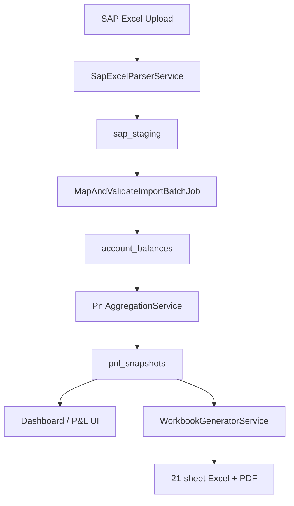

Purpose: Technical reference for understanding system design and development patterns
Last Updated: 2026-07-28

# ArkaLedger System Architecture

## Project Overview

ArkaLedger (FinSight) is an automated multi-site P&L consolidation and financial reporting platform for PT. Arkananta. It replaces manual 21-sheet Excel workbook compilation with a Laravel + React dashboard.

## Technology Stack

- **Frontend**: Inertia.js + React + Ant Design Pro (dark mode default)
- **Backend**: Laravel 13 + PHP 8.5, MySQL (`inhouse_pnl`), Redis/Horizon
- **Excel**: PhpSpreadsheet (styled) + OpenSpout (streaming SPT sheet)
- **PDF**: DomPDF via barryvdh/laravel-dompdf
- **Auth**: Laravel Breeze + Spatie Permission (per-site scoping)

## Core Components

| Layer | Location | Responsibility |
|-------|----------|----------------|
| Controllers | `app/Http/Controllers/` | Thin orchestration, Inertia renders |
| Services | `app/Services/` | Business logic (Import, Pnl, Reports, Intelligence, Sap, Hermes) |
| Jobs | `app/Jobs/` | Horizon-queued async (imports, reports, SAP sync) |
| Repositories | `app/Repositories/` | Read-only cross-app DB access |
| Actions | `app/Actions/` | Single-purpose operations (approve, reject, resolve mapping) |

## Database Schema

Single MySQL database `inhouse_pnl` with tables for:
- Reference: `project_sites`, `accounts`, `pnl_lines`, `coa_mappings`, `report_periods`
- Ledger: `account_balances`, `pnl_snapshots`, `pnl_snapshot_lines`
- Import: `import_batches`, `sap_staging`, `import_column_maps`
- Modules: `journals`, `journal_lines`, `petty_cash_funds`, `petty_cash_expenses`, `tax_filings`, `tax_payments`
- Reports: `report_packages`, `report_artifacts`, `approval_steps`, `delivery_logs`
- Intelligence: `variance_flags`, `reconciliation_checks`, `ratio_snapshots`, `anomaly_alerts`
- Integration: `sap_sync_runs`, `email_templates`, `audit_logs`

## Data Flow

## API Endpoints

- `POST /api/hermes/inbound` — email attachment webhook
- `POST /api/n8n/sap-sync` — trigger SAP pull
- `POST /api/n8n/report-packages/{id}/deliver` — report delivery
- `GET /api/n8n/tax-filings/upcoming` — tax due-date radar
- `GET /api/n8n/ratios/{period}` — ratio export

## Cross-DB Connections

Read-only connections configured in `config/database.php`: `arkfleet`, `daily_production`, `sarang_erp`, `sap` (Phase 4).

## Deployment

- Dev: `php artisan serve` + `npm run dev`
- Queue: `php artisan horizon`
- Scheduler: `ScheduledSapPullJob` at 02:00 daily
