# Financial Dashboard & Report Integration System
## Concept Document

> **Project:** Automated Monthly Accounting Report Compilation & Financial Intelligence Platform
> **Client:** PT. Arkananta — Mining & Construction Contractor, Kalimantan, Indonesia
> **Primary Stakeholder:** Iwan (CPA, 15+ years ERP / SAP Business One expert)
> **Document Type:** Product Vision · Architecture Blueprint · Innovation Roadmap
> **Status:** Draft v1.0 — Greenfield Concept
> **Last Updated:** July 2026

---

## Table of Contents

1. [Executive Summary](#1-executive-summary)
2. [Current State vs Future State](#2-current-state-vs-future-state)
3. [Application Name Candidates](#3-application-name-candidates)
4. [Core Architecture](#4-core-architecture)
5. [Data Integration Strategy](#5-data-integration-strategy)
6. [Entity Relationship Diagram](#6-entity-relationship-diagram)
7. [Module Breakdown](#7-module-breakdown)
8. [Data Flow Diagrams](#8-data-flow-diagrams)
9. [Dashboard & UI Concepts](#9-dashboard--ui-concepts)
10. [Report Automation Engine](#10-report-automation-engine)
11. [Innovation Features Deep-Dive](#11-innovation-features-deep-dive)
12. [Cross-App Integration Details](#12-cross-app-integration-details)
13. [Implementation Phases](#13-implementation-phases)
14. [Open Questions & Decisions](#14-open-questions--decisions)
15. [Technical Considerations](#15-technical-considerations)

---

## 1. Executive Summary

### 1.1 The Problem in One Sentence

Every month, PT. Arkananta's Finance & Accounting team spends **several working days** manually logging into SAP Business One, exporting account-level reports for each of nine project sites, collecting supporting Excel attachments from site offices via email, and stitching all of it together by hand into a single **21-sheet Excel workbook** (`Report Accounting Jan – Dec 2026.xlsx`) that is then emailed to management.

### 1.2 The Solution

A **web-based Financial Dashboard & Report Integration System** that:

- **Ingests** account balances and transaction detail directly from SAP Business One (via a scheduled/semi-automated connector) instead of manual copy-paste.
- **Absorbs** supporting reports (petty cash, cost breakdowns) either through email parsing (Hermes gateway) or intelligent file upload.
- **Cross-references** operational data already captured in sister applications — `arkfleet-next` (equipment & depreciation), `daily-production` (fuel & production), `sarang-erp-laravel` (tax & procurement) — that live on the same VPS.
- **Consolidates** everything into a **live, multi-site P&L dashboard** with the same 2024-vs-current-year comparison structure the CPAs already trust.
- **Regenerates** the exact 21-sheet Excel workbook on demand, produces professional PDF reports, and — after an approval workflow — **auto-delivers** the finished package to management on schedule.
- **Adds intelligence** the manual process never had: variance analysis, anomaly detection, ratio analytics, trend charts, and SAP reconciliation.

### 1.3 Key Value Propositions

| Value | Manual Today | With the System |
|-------|-------------|-----------------|
| **Time to compile report** | 2–5 working days | Minutes (automated), review-only for humans |
| **Error surface** | High (manual copy/paste, formula drift) | Low (deterministic pipeline, reconciliation checks) |
| **Data freshness** | Month-end snapshot only | Real-time as data flows in, locked at month-end close |
| **Auditability** | Excel version chaos | Immutable period archive, full audit log |
| **Insight** | Static numbers | Variance flags, anomaly detection, ratio & trend analytics |
| **Delivery** | Manual email | Scheduled auto-delivery + WhatsApp/Telegram alerts |

### 1.4 Who It Serves

- **CPA / Finance team** — the day-to-day operators who currently do the compilation. They shift from *data janitors* to *analysts & reviewers*.
- **Management** — recipients of the monthly report. They gain a self-service dashboard plus the familiar Excel/PDF deliverable.
- **Site accountants** — scoped access to only their project site's P&L (role-based).
- **Auditors** — read-only access to a locked, versioned historical archive.

### 1.5 Guiding Principle

> **Almost zero manual data entry.** Every number originates from a system of record. The application's job is **integration, transformation, presentation, and delivery** — not bookkeeping. The only human-entered data is administrative (users, roles, chart-of-accounts mapping, explanatory commentary on variances).

---

## 2. Current State vs Future State

### 2.1 Current State — The Manual Monthly Ritual

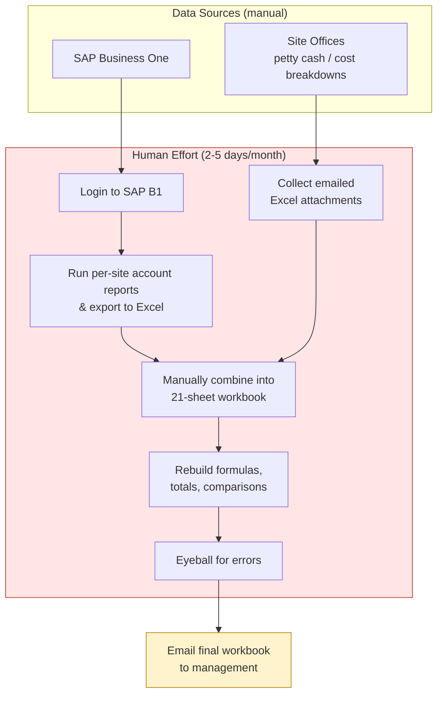

**Pain characteristics:**

- **Repetitive & fragile** — the same clicks every month; one wrong paste corrupts a total.
- **Non-scalable** — a new site (like 026C added in 2025) means more manual sheets.
- **No single source of truth** — the "truth" is whichever Excel file was last emailed.
- **No intelligence** — variances, anomalies, and ratios are computed ad-hoc (if at all).
- **Knowledge concentration** — only a few people know the exact assembly procedure.

### 2.2 Future State — The Automated Pipeline

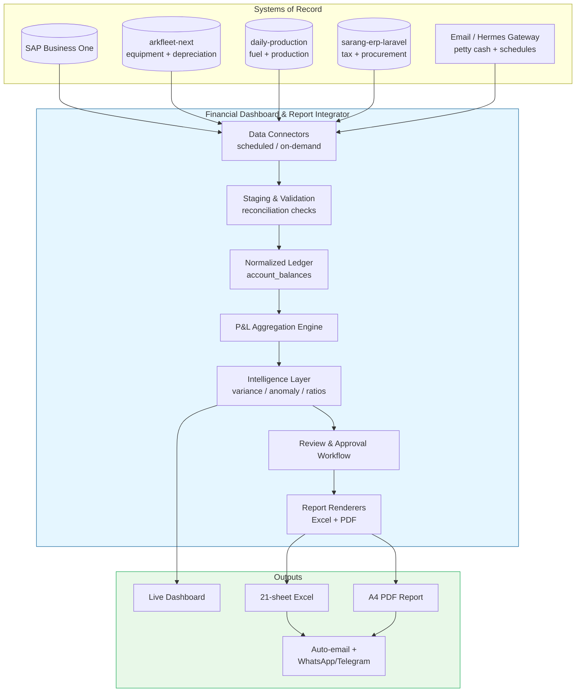

### 2.3 Side-by-Side Comparison

| Dimension | Current (Manual) | Future (Automated) |
|-----------|------------------|--------------------|
| **Trigger** | Human remembers month-end | Scheduled job + on-demand refresh |
| **SAP data entry** | Manual export + paste | Connector pulls balances automatically |
| **Supporting reports** | Collected from email inbox | Parsed automatically or uploaded once |
| **Compilation** | Hand-assembled workbook | Deterministic aggregation engine |
| **Comparisons (2024 vs current)** | Manual formulas | Computed columns, always correct |
| **Validation** | Visual inspection | Automated reconciliation vs SAP totals |
| **Insight** | None / manual | Variance, anomaly, ratio, trend analytics |
| **Review** | Ad-hoc | Structured per-site approval workflow |
| **Delivery** | Manual email | Auto-delivery + instant messaging alerts |
| **History** | Scattered Excel files | Immutable multi-year archive |
| **Access control** | Everyone sees everything | Per-site role-based scoping |

---

## 3. Application Name Candidates

The name should evoke **consolidation, clarity, and financial intelligence**, feel professional to a CPA audience, and sit naturally alongside the existing app family (`arkfleet`, `daily-production`, `sarang-erp`).

| # | Name | Rationale | Tagline |
|---|------|-----------|---------|
| 1 | **ArkaLedger** | Ties to PT. Arkananta; "Ledger" signals accounting authority and the account-balance core. Consistent with the `Ark*` family naming (`arkfleet`). | *"One ledger. Every site. Zero copy-paste."* |
| 2 | **FinSight** | "Financial Insight" — leans into the intelligence/analytics differentiator (variance, anomaly, ratios). Short, memorable, modern. | *"From compilation to comprehension."* |
| 3 | **Konsolidasi** *(brand: **Konso**)** | Indonesian for "consolidation" — the literal job of the app. Locally resonant, describes the core value: consolidating multi-site P&L. | *"Konsolidasi otomatis, laporan siap kirim."* |
| 4 | **ArkaFinance Hub** | Positions the app as the central hub where SAP + sister apps + email converge. Enterprise, self-explanatory. | *"The center of gravity for month-end."* |
| 5 | **LaporIn** | Playful Indonesian: *lapor* (to report) + *in* (do it). Emphasizes automated reporting & delivery. Approachable for daily users. | *"Tinggal review, laporan terkirim."* |

**Recommendation:** **ArkaLedger** as the internal/system name for family consistency and accounting gravitas, with **FinSight** reserved as the user-facing dashboard brand if a more product-y feel is desired. Throughout the rest of this document the working name **ArkaLedger** is used.

---

## 4. Core Architecture

### 4.1 Architectural Style

**Modular monolith (Laravel) with an Inertia/React SPA front end**, augmented by:

- A **connector/adapter layer** isolating each external system (SAP B1, sister apps, email) behind a uniform interface.
- A **staging → normalized → aggregated** data pipeline so raw data is always preserved and transformations are reproducible.
- **Queue-driven** heavy work (imports, reconciliation, report rendering) via Laravel Horizon on Redis.

A monolith is deliberately chosen over microservices: the team is small, the apps already co-reside on one VPS, and shared-database access is available. Complexity is contained in *modules*, not *services*.

### 4.2 System Architecture Diagram

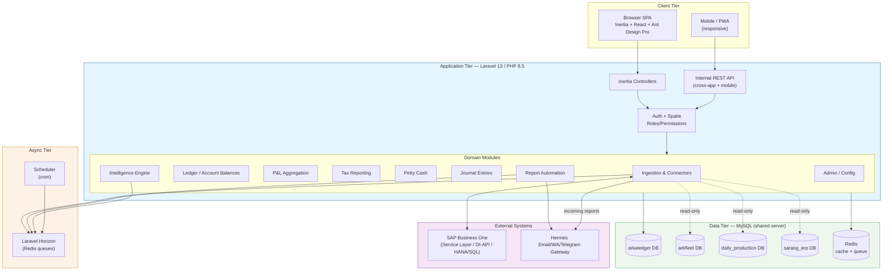

### 4.3 Technology Choices & Rationale

| Layer | Choice | Rationale |
|-------|--------|-----------|
| **Backend framework** | Laravel 13 + PHP 8.5 | Matches Iwan's existing stack (`arkfleet-next`, `sarang-erp`); mature queue/scheduler/ORM. |
| **Frontend** | Inertia.js + React + Ant Design Pro (ProTable) | Consistent with sister apps; ProTable is ideal for dense financial grids with the 2024-vs-current two-column pattern. |
| **Database** | MySQL (shared server) | Same server as other apps → enables read-only cross-DB access without network hops. |
| **Auth & AuthZ** | Laravel auth + Spatie Permission | Fine-grained per-site permissions (Site A accountant sees only Site A). |
| **Queue / async** | Laravel Horizon on Redis | Long-running imports, reconciliation, and report rendering must not block requests. |
| **Excel export** | PhpSpreadsheet directly (see §15) | `maatwebsite/excel` is blocked on PHP 8.5; use its underlying `phpoffice/phpspreadsheet` or `openspout/openspout` for large sheets. |
| **PDF** | DomPDF (or `spatie/laravel-pdf` via Browsershot for complex layouts) | Professional A4 management reports. |
| **Charts** | Ant Design Charts / Recharts | Trend & ratio visualizations in the dashboard. |
| **Cross-app integration** | Read-only shared MySQL + optional REST | Fastest path given co-located apps; REST for anything requiring the source app's business logic. |
| **Scheduling** | Laravel Scheduler | Month-end triggers, nightly SAP pulls, reminder notifications. |

### 4.4 Layered Data Pipeline

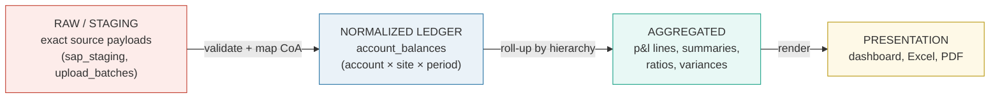

**Why three layers?** It lets the system (a) keep an audit-grade copy of exactly what SAP returned, (b) re-run aggregation logic if the P&L structure or CoA mapping changes, and (c) reconcile any presented number back to its raw source — essential for a CPA audience.

---

## 5. Data Integration Strategy

### 5.1 Overview of Sources

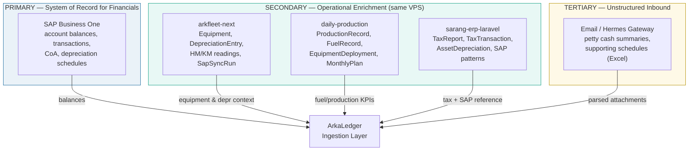

### 5.2 SAP Business One — Ingestion Options

Three viable mechanisms, in **recommended priority order**:

| Option | Mechanism | Pros | Cons | Verdict |
|--------|-----------|------|------|---------|
| **A. Service Layer API** | SAP B1 Service Layer (OData/REST) over HTTPS | Real, supported, semantic access to JournalEntries, ChartOfAccounts, business objects | Requires Service Layer enabled + licensed; auth session management | **Preferred** if Service Layer is available |
| **B. Direct DB query (HANA/SQL)** | Read-only query against SAP company DB (`OACT`, `JDT1`, `OJDT`, `PRC1` cost centers) | Fastest, no API limits, full historical depth | Bypasses SAP business logic; schema coupling; must be strictly read-only | **Strong fallback**, mirrors how `sarang-erp` and `arkfleet` already sync (`SapSyncRun`, `SapPostingLog`) |
| **C. File-based import** | Scheduled SAP export → watched folder / upload → intelligent parser | Zero SAP-side integration effort; works even if IT restricts API/DB | Still semi-manual; parsing fragility | **Bridge/MVP option** — start here, graduate to A or B |

**Recommendation — Semi-automated to fully-automated glide path:**

1. **Phase 1 (MVP):** File-based import (Option C) with an *intelligent parser* — user uploads the SAP-exported Excel/CSV once per site; the system maps columns, detects the "SAP" marker row, and stages the data. This immediately eliminates hand-assembly while requiring **no SAP IT involvement**.
2. **Phase 2:** Direct read-only DB pull (Option B) on a nightly schedule, reusing the proven `SapSyncRun` pattern from the sister apps. Upload remains as a manual override.
3. **Phase 3:** Service Layer (Option A) for richer semantics and, optionally, posting journals back (see §14 open question).

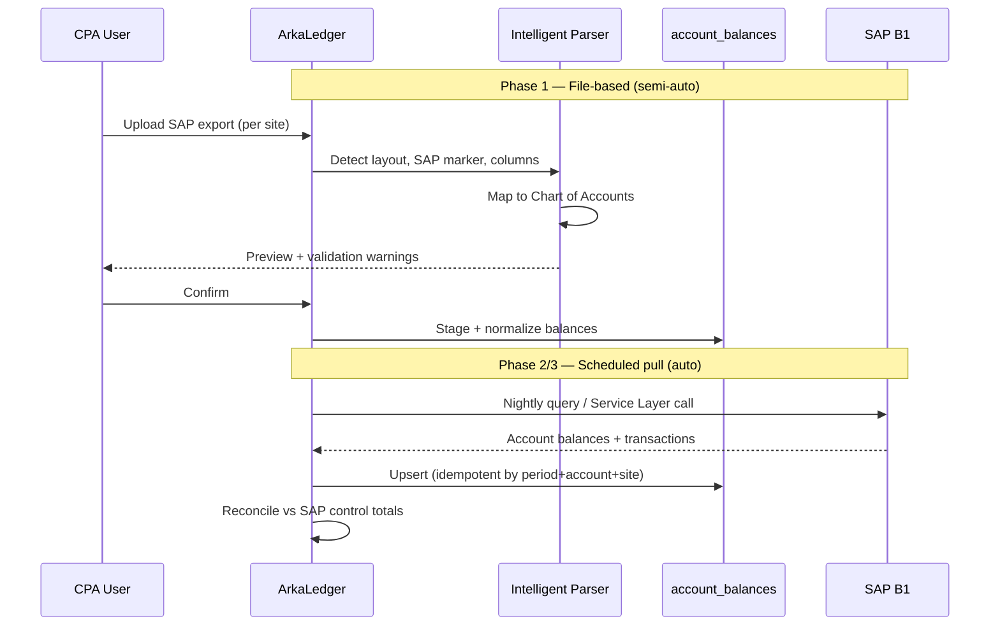

### 5.3 Chart of Accounts Mapping

The bridge between SAP's raw account codes and the report's P&L hierarchy is a **configurable mapping table** (admin-maintained, versioned):

- SAP account `51100` → report line **Cost of Sales › Fuel**
- SAP account `51100002` → report line **Cost of Sales › Fuel › Fuel Transportation** (sub-account, nested)
- SAP account `400` → **Revenue › Revenue Invoices**

This mapping is the *only* place where the SAP structure and the report structure are reconciled, and it is **data, not code** — so adding an account never requires a deployment.

### 5.4 Cross-App Integration Decision

**Do not duplicate master data. Reference it.** Because all apps share the MySQL server:

- **Equipment master & depreciation** → read from `arkfleet-next` (read-only connection). ArkaLedger stores only a *reference* (unit code + period) plus the derived amounts it needs, refreshed on import.
- **Fuel & production KPIs** → read from `daily-production` for ratio analytics (fuel efficiency, stripping ratio), not for the P&L balances themselves (those come from SAP).
- **Tax reference** → `sarang-erp-laravel` already models `TaxReport`/`TaxTransaction`; ArkaLedger can either consume these via a read-only view or re-implement the tax module natively (decision in §14). SAP remains the authoritative financial source.

**Rule of thumb:** *Financial truth = SAP. Operational context = sister apps. ArkaLedger owns only the consolidation, mapping, intelligence, and delivery layers.*

### 5.5 Email / Hermes Gateway Ingestion

For petty cash summaries and supporting schedules that arrive as email attachments:


Auto-parsing is **template-driven**: known site templates parse straight through; unknown layouts are held for manual mapping (which then *teaches* a new template). This keeps the tertiary channel automated where possible without silently ingesting garbage.

---

## 6. Entity Relationship Diagram

### 6.1 Core Domain ERD

The data model is organized around **period × site × account** as the central grain, with configuration entities feeding it and output/workflow entities depending on it.

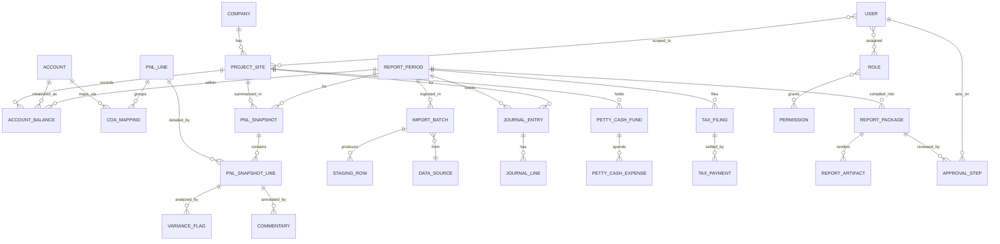

### 6.2 Key Tables (illustrative schema)

**`account_balances`** — the normalized core (one row per account × site × period):

| Column | Type | Notes |
|--------|------|-------|
| id | bigint PK | |
| report_period_id | FK | month/year period |
| project_site_id | FK | 017C, 021C, … HO, JKT |
| account_id | FK | links to `accounts` (SAP code) |
| debit | decimal(18,2) | |
| credit | decimal(18,2) | |
| balance | decimal(18,2) | signed, period movement |
| source | enum | `sap`, `upload`, `email`, `sister_app` |
| import_batch_id | FK | provenance |
| is_locked | boolean | true after month-end close |
| created_at / updated_at | timestamp | |

**`accounts`** — chart of accounts (mirrors SAP CoA):

| Column | Type | Notes |
|--------|------|-------|
| id | bigint PK | |
| sap_code | string | e.g. `51100`, `51100002` |
| name | string | e.g. "Fuel", "Fuel Transportation" |
| parent_id | FK nullable | sub-account nesting |
| account_type | enum | revenue / cost_of_sales / expense / other |
| is_sub_account | boolean | |

**`coa_mappings`** — SAP account → report P&L line (versioned):

| Column | Type | Notes |
|--------|------|-------|
| id | bigint PK | |
| account_id | FK | |
| pnl_line_id | FK | target report line |
| effective_from | date | supports remapping over time |
| version | int | |

**`report_periods`** — the fiscal calendar & lock state:

| Column | Type | Notes |
|--------|------|-------|
| id | bigint PK | |
| year | smallint | |
| month | tinyint | |
| status | enum | `open`, `in_review`, `locked` |
| baseline_year | smallint | comparison year (e.g. 2024) |
| locked_at / locked_by | | audit |

**`pnl_snapshots` / `pnl_snapshot_lines`** — materialized P&L for fast dashboard & reproducible reports (regenerated on import, frozen on lock).

**`report_packages` / `report_artifacts`** — a compiled monthly deliverable and its rendered files (Excel, PDF), plus delivery metadata.

**`variance_flags`, `commentary`, `anomaly_alerts`** — the intelligence layer's outputs, attached to P&L lines.

### 6.3 Design Notes for the CPA Audience

- **Double-entry preserved** in `journal_entries`/`journal_lines` so depreciation journals reconcile (debit = credit) exactly as in the JOURNAL ENTRY sheet.
- **Immutability at close:** locking a period freezes `account_balances` and the `pnl_snapshot`, guaranteeing an audit trail identical to the emailed workbook of record.
- **Provenance everywhere:** every balance row carries `source` + `import_batch_id`, enabling drill-down from a P&L figure all the way back to the exact SAP export or email attachment.

---

## 7. Module Breakdown

Each module below lists its **purpose**, **key features**, **UX pattern** (Ant Design Pro), and **innovation hooks**.

### 7.1 Ingestion & Connectors Module

- **Purpose:** Get data in — from SAP, sister apps, and email — reliably and idempotently.
- **Features:**
  - SAP connector (file/DB/Service Layer, pluggable adapter).
  - Intelligent Excel/CSV parser with column auto-mapping and "SAP marker" detection.
  - Import batch tracking (mirrors `SapSyncRun`: status, created/updated/failed counts, error summary, triggered_by).
  - Email/Hermes inbound watcher with template classification.
- **UX:** An **Import Center** — ProTable of import batches with status chips, a stepper wizard for uploads (Upload → Map columns → Preview → Confirm), and a live progress drawer for scheduled pulls.
- **Innovation:** *Learning parser* that remembers column mappings per source/template; *reconciliation gate* that blocks import if totals don't match SAP control figures.

### 7.2 Ledger / Account Balances Module

- **Purpose:** The normalized single source of consolidated truth.
- **Features:** Query balances by period/site/account; provenance drill-down; lock/unlock at period close.
- **UX:** Account explorer with tree view (CoA hierarchy) and a period slider.
- **Innovation:** *Time-travel* — view balances "as they were" at any past close via the immutable snapshot.

### 7.3 Multi-Site P&L Module

- **Purpose:** Reproduce and surpass the per-site P&L sheets (P&L 017C, 021C, …).
- **Features:**
  - Per-site P&L with the **two-column 2024-vs-current** layout.
  - Monthly columns Jan–Dec + TOTAL / AVERAGE / PERCENTAGE computed columns.
  - Full account hierarchy (Revenue → Cost IPH → Cost of Sales → sub-accounts → Depreciation → Other → computed P&L).
- **UX:** Ant Design **ProTable** with frozen left label column, grouped/expandable rows for the hierarchy, and sticky comparison headers. Toggle between "Rincian" (detail) and "P&L" (summary) view of the same data.
- **Innovation:** Inline variance coloring (red/green), sparkline mini-trends per line, one-click drill to underlying transactions.

### 7.4 Consolidated P&L Module

- **Purpose:** The SUMMARY P&L sheet — all sites combined.
- **Features:** Sum across all active sites; per-site contribution breakdown; consolidated 2024-vs-current comparison.
- **UX:** Executive summary grid + a stacked contribution chart showing each site's share of revenue/cost.
- **Innovation:** *What-if exclusion* — toggle a site off to see consolidated impact (e.g., exclude the new 026C ramp-up).

### 7.5 Tax Reporting Module

- **Purpose:** Reproduce MONTHLY TAX REPORT + SPT & PAYMENT sheets.
- **Features:** PPN, PPh 23, PPh 21 (per location), PPh 4(2), PPh 25 tracking; filing status; payment history (handles the large multi-year SPT dataset).
- **UX:** Tabbed by tax type; ProTable with filing/payment status, due-date and overdue indicators (reuse the `TaxReport` status model from `sarang-erp`).
- **Innovation:** *Due-date radar* — upcoming filing deadlines with WhatsApp reminders; auto-reconcile PPN input/output totals against SAP.

### 7.6 Journal Entry Module

- **Purpose:** Reproduce the JOURNAL ENTRY sheet — monthly depreciation journals per site with approval tracking.
- **Features:** Debit/credit paired lines; per-site depreciation journals; approval state; balanced-entry validation.
- **UX:** Journal list with balance badges (must net to zero); expandable line detail; approve/reject controls.
- **Innovation:** Depreciation journals **pre-filled from `arkfleet-next` `DepreciationEntry`** (opening NBV, depreciation amount, accumulated, closing NBV) — the CPA reviews rather than re-enters.

### 7.7 Petty Cash Module

- **Purpose:** Reproduce the PETTY CASH SUMMARY sheet.
- **Features:** Fund received + expense detail per site/HQ; running balance; replenishment tracking.
- **UX:** Fund cards per site with balance; expense ProTable; import from emailed site templates.
- **Innovation:** Auto-ingest from Hermes inbox; flag expenses exceeding thresholds.

### 7.8 Intelligence Engine Module

- **Purpose:** The analytics differentiator (detailed in §11).
- **Features:** Variance analysis, anomaly detection, ratio analysis, trend analytics.
- **UX:** An **Insights** panel surfaced both standalone and inline within P&L rows.
- **Innovation:** The entire module — this is what the manual process never had.

### 7.9 Report Automation Module

- **Purpose:** Generate → review → approve → deliver the monthly package (detailed in §10).
- **Features:** 21-sheet Excel regeneration, A4 PDF, approval workflow, scheduled auto-delivery, notifications.
- **UX:** A **Report Studio** — build/preview package, per-site approval board, delivery scheduler.
- **Innovation:** One-click "recreate the exact email deliverable," plus policy-driven auto-send.

### 7.10 Admin & Configuration Module

- **Purpose:** The only place with meaningful manual input.
- **Features:**
  - **User management** — CRUD, role assignment.
  - **Roles & permissions** — Spatie-based, per-site scoping.
  - **Chart of Accounts mapping** — SAP account → P&L line.
  - **Project site configuration** — add/remove sites, define account structure.
  - **Report period management** — open/close/lock periods.
- **UX:** Standard Ant Design Pro CRUD tables + a visual CoA-mapping designer (drag SAP accounts onto report lines).
- **Innovation:** *Mapping simulator* — preview how a mapping change reshapes the P&L before committing.

---

## 8. Data Flow Diagrams

### 8.1 End-to-End: SAP → Import → P&L → Report

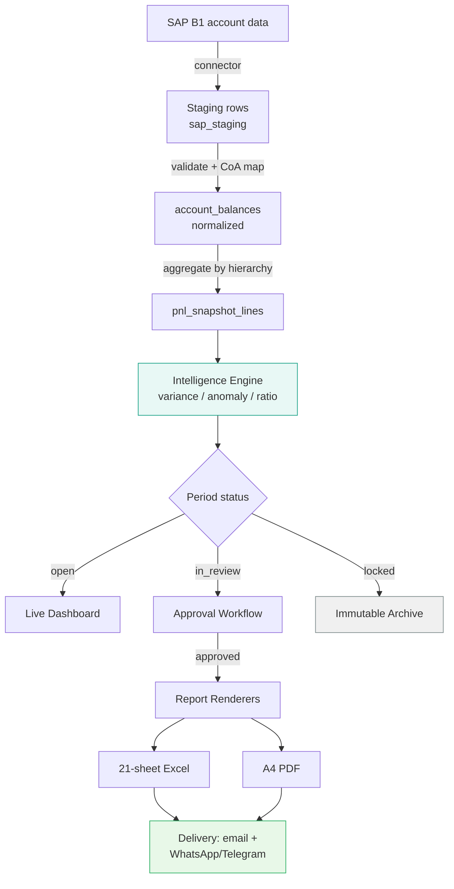

### 8.2 Monthly Close State Machine

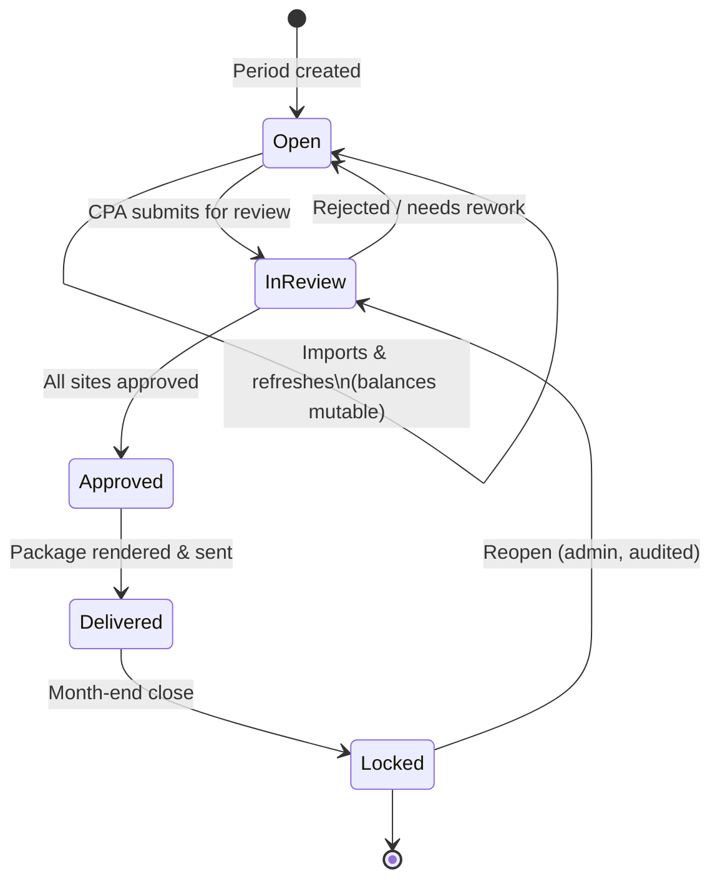

### 8.3 Depreciation Journal Enrichment Flow

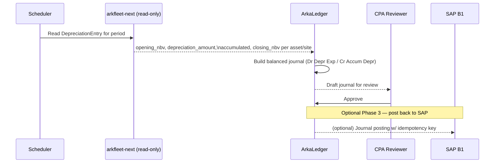

### 8.4 Ratio Analytics Cross-App Flow

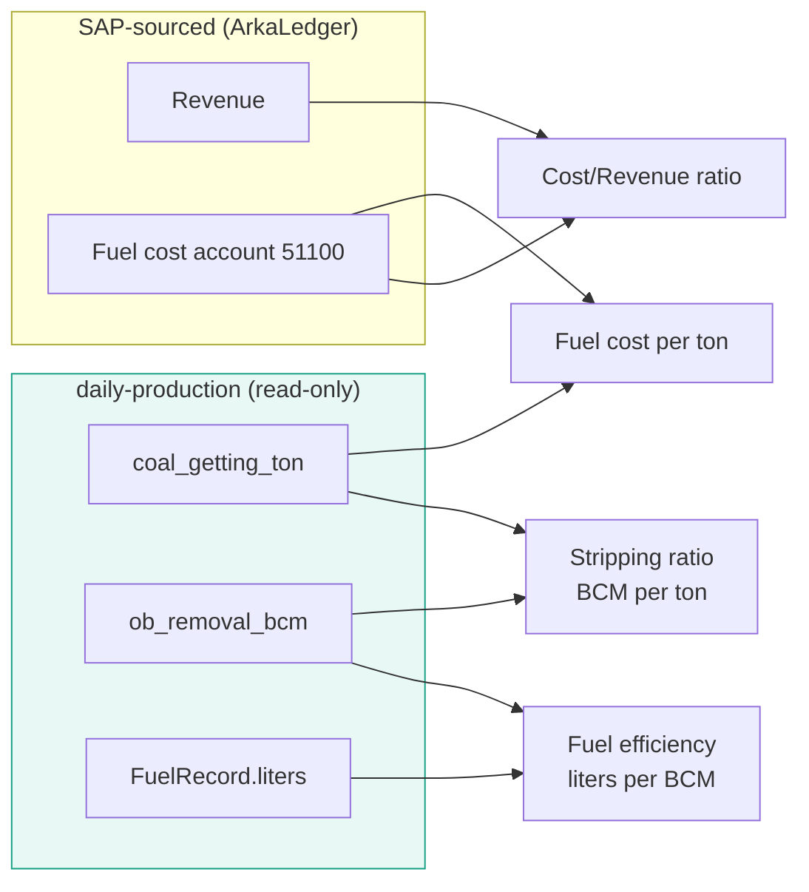

---

## 9. Dashboard & UI Concepts

> These are **wireframe descriptions**, not builds. They translate the Excel workbook's mental model into an interactive interface.

### 9.1 Executive Home (Consolidated Dashboard)

```
┌─────────────────────────────────────────────────────────────────────┐
│  ArkaLedger      Period: [ July 2026 ▾ ]   Status: ● In Review        │
├─────────────────────────────────────────────────────────────────────┤
│  KPI CARDS                                                            │
│  ┌───────────┐ ┌───────────┐ ┌───────────┐ ┌───────────┐            │
│  │ Revenue   │ │ Cost IPH  │ │ Net P&L   │ │ vs 2024   │            │
│  │ 128.4 B   │ │  92.1 B   │ │  36.3 B   │ │ ▲ +12.4%  │            │
│  │ ▲ +8.2%   │ │ ▲ +5.1%   │ │ ▲ +18.9%  │ │  (green)  │            │
│  └───────────┘ └───────────┘ └───────────┘ └───────────┘            │
├─────────────────────────────────────────────────────────────────────┤
│  [ Revenue vs Cost trend — 24 months line chart ]                     │
│  [ Per-site contribution — stacked bar ]                              │
├─────────────────────────────────────────────────────────────────────┤
│  INSIGHTS FEED                          │  SITE STATUS BOARD          │
│  ⚠ 026C fuel cost +42% MoM (anomaly)   │  017C ✔ approved            │
│  ⚠ 021C stripping ratio below plan     │  021C ● in review           │
│  ✔ SAP reconciliation passed            │  022C ✔ approved            │
│                                          │  026C ✎ needs commentary   │
└─────────────────────────────────────────────────────────────────────┘
```

- **Period selector** drives the whole screen; status chip reflects the close state machine.
- **Insights feed** surfaces variance/anomaly flags with one-click drill-down.
- **Site status board** doubles as the approval-workflow entry point.

### 9.2 Site P&L Screen (Rincian / P&L toggle)

- **Frozen left column** = account hierarchy labels (Revenue → Cost of Sales → 51100 Fuel → 51100002 Fuel Transportation → …).
- **Two macro-column groups:** `2024 (baseline)` and `2026 (current)`, each with Jan–Dec + TOTAL / AVG / %.
- **Expandable rows** collapse Cost of Sales into a single line or expand to sub-accounts.
- **Right rail:** commentary & variance flags for the selected line.
- **View toggle:** *Rincian* (full detail) ↔ *P&L* (summary) — same data, different density, mirroring the Excel sheet pairs.

### 9.3 Import Center

- ProTable of import batches: source, period, status, created/updated/failed counts, triggered_by, timestamp.
- **Upload wizard** (stepper): Select file → Auto-detect layout & SAP marker → Map columns → Preview with reconciliation → Confirm.
- Scheduled-pull monitor with live Horizon job progress.

### 9.4 Report Studio

- **Package builder:** choose period, sites, sections; live preview of each of the 21 sheets as tabs.
- **Approval board:** kanban-style columns (Draft → In Review → Approved) with per-site cards.
- **Delivery scheduler:** recipients, channels (email/WA/Telegram), send-now vs scheduled, and delivery log.

### 9.5 Tax Center

- Tabs per tax type (PPN, PPh 23, PPh 21, PPh 4(2), PPh 25).
- Filing calendar with due-date radar; payment history table (optimized for the 65K-row SPT dataset via server-side pagination in ProTable).

### 9.6 Mobile / PWA

- Responsive layout; dashboard KPIs and insights feed are the primary mobile surface.
- Push notifications for anomalies and "report ready."
- Report review/approval possible on mobile; heavy grids remain desktop-first.

---

## 10. Report Automation Engine

### 10.1 Goal

Reproduce the **exact 21-sheet Excel deliverable** currently emailed to management — byte-for-structure faithful — while adding an approval gate and scheduled delivery.

### 10.2 Sheet Generation Map

| # | Sheet | Data Source in ArkaLedger |
|---|-------|---------------------------|
| 1 | JOURNAL ENTRY | `journal_entries` (enriched from arkfleet depreciation) |
| 2 | PETTY CASH SUMMARY | `petty_cash_funds` + `petty_cash_expenses` |
| 3 | SPT & PAYMENT | `tax_filings` + `tax_payments` |
| 4 | MONTHLY TAX REPORT | tax module aggregation |
| 5–9 | Rincian 017C/021C/022C/025C | `pnl_snapshot_lines` (detail view) |
| 10–13 | P&L 017C/021C/022C/025C | `pnl_snapshots` (summary view) |
| 14–15 | Rincian / P&L APS in CHO | APS site snapshot |
| 16–17 | Rincian / P&L HO & JKT | admin-site snapshots |
| 18 | SUMMARY P&L | consolidated aggregation |
| 19–20 | Rincian / P&L 026C | new-site snapshot |
| 21–22 | Rincian / P&L 023C | site snapshot |

A **workbook template engine** maps each snapshot to a sheet layout (styles, merged headers, the 2024/current column groups, computed TOTAL/AVG/% columns), driven by PhpSpreadsheet (see §15 for the PHP 8.5 constraint).

### 10.3 Generate → Review → Approve → Deliver

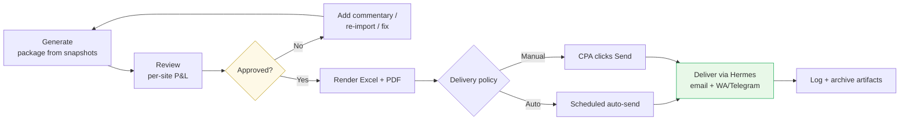

### 10.4 Recommended Automation Level

**"Generate → review → approve → send" as the default, with opt-in full auto per period.**

Rationale: a CPA-grade process demands a human sign-off before management sees numbers. But once a period's sites are all approved, delivery itself is fully automated and scheduled. Iwan can enable *lights-out* auto-send for stable periods where reconciliation passes cleanly and no anomaly flags remain open — the system escalates to manual only when something looks off.

### 10.5 Delivery & Notification

- **Primary:** email the Excel + PDF package to a management distribution list.
- **Secondary:** WhatsApp/Telegram message via **Hermes gateway** — "July 2026 report is ready" with a deep link, or "Anomaly detected at 026C" alerts.
- **Audit:** every delivery logged (recipients, channel, artifact hash, timestamp) for traceability.

---

## 11. Innovation Features Deep-Dive

Iwan explicitly asked for **inovasi**. The manual Excel process is purely *descriptive* — it records what happened. The innovations below make ArkaLedger *diagnostic, predictive, and proactive*.

### 11.1 Variance Analysis (Feature #11)

**What:** Auto-compute and visually flag deviations across three axes:
- **Year-over-year:** current year vs the 2024 baseline column already present in every sheet.
- **Month-over-month:** each account vs prior month.
- **Budget vs actual:** where a `MonthlyPlan`/`PlanTarget` exists (from `daily-production`) or an admin-entered budget.

**How it's surfaced:**
- Inline red/green cell coloring + directional arrows in the P&L grid.
- A threshold model: variances beyond configurable % or absolute bands are promoted to the Insights feed.
- Materiality-aware: small-rupiah swings on large accounts don't shout; a 5% jump on fuel does.

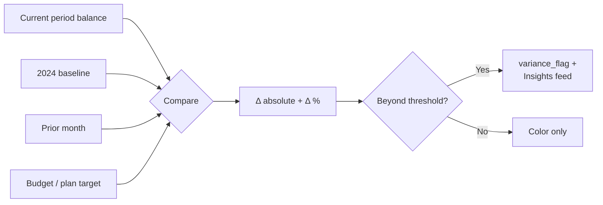

### 11.2 Anomaly Detection (Feature #14)

**What:** Flag unusual spikes/dips in cost accounts before they reach management — e.g., a sudden fuel cost jump at a single site.

**How:**
- **Statistical baseline:** rolling mean ± k·σ over trailing months per account × site (z-score outliers).
- **Ratio-aware:** cross-check against operational drivers — a fuel-cost spike is *expected* if production (BCM/ton from `daily-production`) rose proportionally; it's *anomalous* if cost rose while output was flat.
- **Explainable:** each alert states the expected range, the observed value, and the likely driver ("+42% fuel cost, but OB removal only +3% → efficiency degradation or price change").

This ratio-aware cross-check is a genuine differentiator only possible *because* production data lives next door in `daily-production`.

### 11.3 Ratio Analysis (Feature #13)

Auto-computed financial & operational ratios, refreshed each import:

| Ratio | Formula | Sources |
|-------|---------|---------|
| Cost/Revenue | Cost IPH ÷ Revenue | ArkaLedger (SAP) |
| Fuel efficiency | fuel liters ÷ OB removal BCM | daily-production |
| Stripping ratio | OB removal BCM ÷ coal getting ton | daily-production |
| Fuel cost per ton | fuel cost ÷ coal getting ton | SAP + daily-production |
| Depreciation intensity | depreciation ÷ revenue | arkfleet + SAP |
| Gross margin % | (Revenue − Cost of Sales) ÷ Revenue | SAP |

Displayed as trend sparklines and benchmarked against site history and plan.

### 11.4 Trend Analytics (Feature #12)

- Revenue/cost trend lines across up to 24 months (current + baseline year).
- Per-account small-multiples so a CPA can scan Fuel, Rental, Spare Parts side by side.
- Seasonality overlay (wet vs dry season affects mining output in Kalimantan).

### 11.5 SAP Reconciliation (Feature #16)

**What:** Prove that imported data equals the source-of-record before any report goes out.

**How:**
- On each import, capture SAP control totals (per site, per account group).
- Compare against ArkaLedger's normalized sums.
- **Reconciliation gate:** an unreconciled period cannot advance to `Approved`. Discrepancies are itemized down to the offending account.
- Reuses the provenance model (`import_batch_id`, `source`) and mirrors the `SapSyncRun`/`SapPostingLog` idempotency pattern proven in the sister apps.

### 11.6 Approval Workflow (Feature #15)

- Per-site P&L approval before consolidation is finalized.
- Configurable steps (site accountant → finance manager → CPA sign-off).
- Rejections carry required commentary and route back to the responsible party.
- Full audit trail of who approved what and when.

### 11.7 Commentary / Notes (Feature #17)

- CPAs attach explanatory notes to any P&L line or variance flag.
- Notes flow into the rendered report (footnotes) — the "story behind the numbers" that management always asks for.
- Notes are versioned per period and archived.

### 11.8 Anomaly & Report Notifications via Hermes (Feature #20)

- WhatsApp/Telegram alerts for: report ready, anomaly detected, filing deadline approaching, reconciliation failure.
- Uses the existing **Hermes gateway** — no new messaging infrastructure.

### 11.9 Real-time vs Month-End Lock (Feature #19)

- **Open period:** dashboard updates live as data flows in — management can preview the month in progress.
- **Locked period:** frozen snapshot, immutable, audit-grade — matching exactly what was delivered.

### 11.10 Multi-Year Archive (Feature #18)

- Every locked period is a permanent, queryable snapshot.
- Powers trend analytics and satisfies audit/retention needs.
- The 2017–2026 SPT history and prior workbooks can be back-filled (see §14 migration decision).

### 11.11 Innovation Summary Map

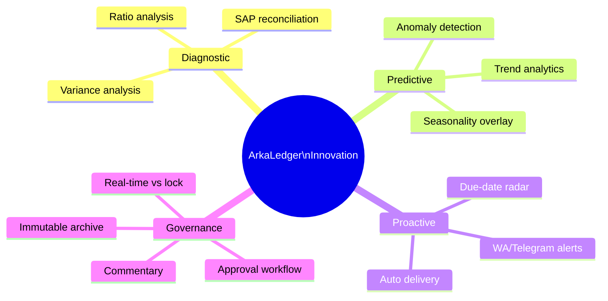

---

## 12. Cross-App Integration Details

All four systems share one MySQL server, enabling **read-only cross-database access** as the fast path, with **REST** reserved for logic-bearing calls.

### 12.1 Integration Topology

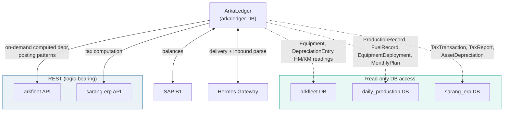

### 12.2 arkfleet-next Integration

**Consumed for:** depreciation journals and equipment context.

| ArkaLedger Need | arkfleet Source | Access |
|-----------------|-----------------|--------|
| Depreciation amounts per site/period | `DepreciationEntry` (opening_nbv, depreciation_amount, accumulated_depreciation, closing_nbv, period_date, book_type) via `DepreciationRun` | Read-only DB |
| Equipment master (unit_code, description, plant_type) | `Equipment` (+ `PlantType`, `UnitModel`) | Read-only DB |
| Equipment utilization (HM/KM) | `EquipmentHmKmReading` (latest HM/KM) | Read-only DB |
| Project/site mapping | `Project` (code, sap_code) | Read-only DB |
| SAP sync patterns to emulate | `SapSyncRun`, `SapPostingLog` | Pattern reference |

**Design:** ArkaLedger reads `DepreciationEntry` for the period, groups by site (via `Equipment.project_code` → `Project.code`/`sap_code`), and builds balanced depreciation journal drafts for the JOURNAL ENTRY sheet. It stores only the derived journal, not a copy of the fixed-asset register.

### 12.3 daily-production Integration

**Consumed for:** operational ratios and anomaly cross-checks.

| ArkaLedger Need | daily-production Source | Access |
|-----------------|-------------------------|--------|
| Fuel volume per site/period | `FuelRecord.liters`, `working_hours`, `usage_category` | Read-only DB |
| Production output | `ProductionRecord.ob_removal_bcm`, `coal_getting_ton`, `coal_hauling_ton` | Read-only DB |
| Equipment deployment context | `EquipmentDeployment`, `EquipmentAssignment` | Read-only DB |
| Plan/budget targets | `MonthlyPlan`, `PlanTarget` | Read-only DB |
| Site mapping | `Site.code`, `ProjectSiteMapping.project_code` | Read-only DB |

**Design:** Used purely for the intelligence layer (fuel efficiency, stripping ratio, budget variance) — never as the source for financial balances. `ProjectSiteMapping` bridges production `site_id` to the SAP `project_code` so operational KPIs align with financial sites.

### 12.4 sarang-erp-laravel Integration

**Consumed for:** tax reference and SAP-integration patterns.

| ArkaLedger Need | sarang-erp Source | Access |
|-----------------|-------------------|--------|
| Tax transactions/filings | `TaxReport`, `TaxTransaction`, `TaxPeriod` (report_type, report_data JSON, status workflow) | Read-only DB or REST |
| Asset depreciation reference | `AssetDepreciationRun`, `AssetDepreciationEntry` | Read-only DB |
| Tax compliance history | `TaxComplianceLog` | Read-only DB |
| SAP posting reference | `BusinessPartner` sync, posting logs | Pattern reference |

**Design decision (see §14):** The tax module can either **consume** `sarang-erp`'s tax data (avoiding duplication) or **re-implement** natively with SAP as source. Given `sarang-erp` already has a mature `TaxReport` model with the exact Indonesian tax types (spt_ppn, spt_pph_21/22/23/26, spt_pph_4_2), **consuming it via a read-only view or REST endpoint is preferred** for the MONTHLY TAX REPORT and SPT & PAYMENT sheets.

### 12.5 Site Code Reconciliation

A subtle but critical integration concern: each app identifies sites differently.

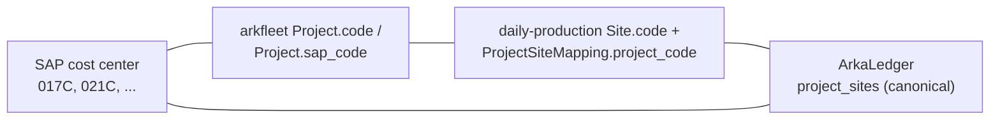

ArkaLedger maintains the **canonical `project_sites` table** (017C, 021C, 022C, 023C, 025C, 026C, APS, HO, JKT) and stores crosswalk mappings to each sister app's identifiers, so a single site's financial + operational data always aligns.

---

## 13. Implementation Phases

A phased approach that delivers value early (eliminate manual assembly) and layers intelligence progressively.

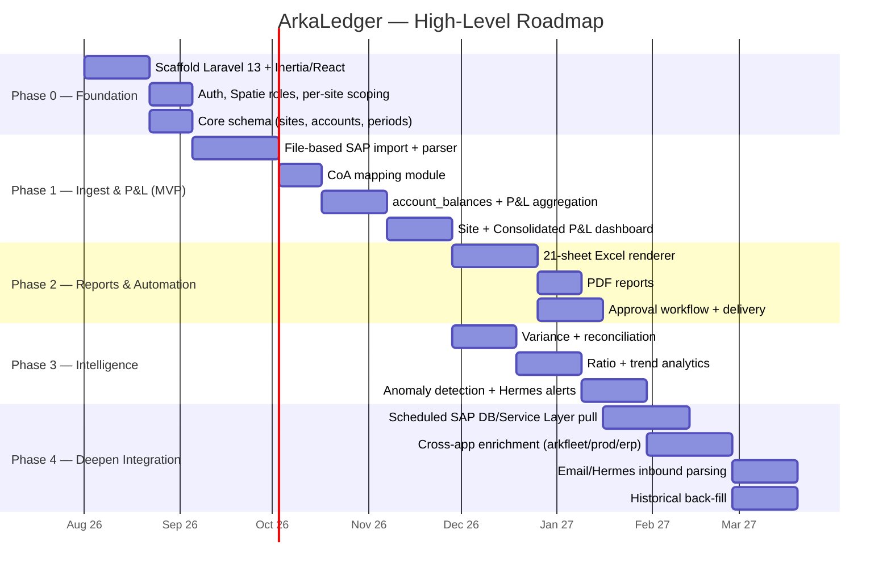

### 13.1 Phase Summaries

- **Phase 0 — Foundation:** Project scaffold, auth, roles/permissions with per-site scoping, canonical `project_sites`, `accounts`, `report_periods`.
- **Phase 1 — Ingest & P&L (MVP):** File-based SAP import with intelligent parser, CoA mapping, normalized `account_balances`, P&L aggregation, and the live site + consolidated dashboards. **This alone eliminates manual assembly** — the core ROI.
- **Phase 2 — Reports & Automation:** Faithful 21-sheet Excel regeneration, PDF, approval workflow, and scheduled delivery via Hermes. Replaces the manual email deliverable end-to-end.
- **Phase 3 — Intelligence:** Variance analysis, SAP reconciliation gate, ratio & trend analytics, anomaly detection, and notifications — the *inovasi* layer.
- **Phase 4 — Deepen Integration:** Move from upload to scheduled SAP pulls, wire in cross-app enrichment (depreciation from arkfleet, ratios from daily-production, tax from sarang-erp), email inbound parsing, and historical back-fill.

### 13.2 MVP Definition

The minimum lovable product = **Phase 0 + Phase 1 + Excel export from Phase 2**. At that point the CPA uploads SAP exports, reviews an accurate consolidated P&L on screen, and clicks to regenerate the exact workbook — replacing days of manual work — even before the intelligence and full-automation layers arrive.

---

## 14. Open Questions & Decisions

Items requiring Iwan's / stakeholder input, each with a recommended default so work can proceed if no answer is given.

| # | Question | Options | Recommendation |
|---|----------|---------|----------------|
| 1 | **App name** | ArkaLedger / FinSight / Konso / ArkaFinance Hub / LaporIn | **ArkaLedger** (system) + FinSight (brand, optional) |
| 2 | **SAP ingestion** | API / DB / File upload; auto vs semi-auto | **Glide path:** file upload MVP → scheduled read-only DB → Service Layer |
| 3 | **Cross-app data** | Reference (API/shared DB) vs own copy | **Reference** via read-only DB; store only derived values |
| 4 | **Storage model** | Raw balances → aggregate vs P&L-level direct | **Normalized `account_balances`** then aggregate — best auditability |
| 5 | **Historical migration** | Import all 2017–2026 vs start fresh | **Fresh from a chosen fiscal year** (e.g., 2024 baseline + 2026), back-fill SPT history separately as read-only archive |
| 6 | **Automation level** | Auto-send vs review→approve→send | **Review→approve→send** default; opt-in full auto per stable period |
| 7 | **Multi-tenant** | Single-company vs multi-company | **Single-company multi-site now**, design site/period tables tenant-ready for future |
| 8 | **Mobile** | Responsive / PWA / desktop-only | **Responsive + PWA** for dashboard/insights/approvals; grids desktop-first |
| 9 | **SAP depth** | Import only vs post-back/real-time | **Import + reconcile** first; journal post-back to SAP as a later, opt-in Phase 3+ capability |
| 10 | **Email parsing** | Auto-parse via Hermes vs manual upload | **Template-driven auto-parse** with manual fallback for unknown layouts |

### 14.1 Key Assumptions

- SAP B1 site codes map cleanly to the nine canonical `project_sites`; a crosswalk handles discrepancies.
- Read-only DB credentials to the three sister databases can be provisioned on the shared server.
- The Hermes gateway can both **send** (email/WA/Telegram) and **receive** (inbound inbox for parsing).
- The 2024 baseline is the agreed comparison year; the "current year" advances with the fiscal calendar.
- Depreciation is authoritative in `arkfleet-next` for equipment; SAP holds the posted financial balances.

### 14.2 Risks & Mitigations

| Risk | Impact | Mitigation |
|------|--------|-----------|
| SAP API/DB access delayed by IT | Blocks auto-pull | File-upload MVP works with zero SAP-side changes |
| Site code mismatches across apps | Wrong consolidation | Canonical `project_sites` + explicit crosswalk mappings + reconciliation gate |
| Excel fidelity expectations very high | Rejected deliverable | Template-driven renderer validated sheet-by-sheet against a reference workbook |
| Large datasets (65K+ SPT rows) | Slow grids | Server-side pagination, indexed queries, columnar export via openspout |
| PHP 8.5 library incompatibility | Build blockers | Use PhpSpreadsheet/openspout directly (see §15) |

---

## 15. Technical Considerations

### 15.1 PHP 8.5 Compatibility

- **Laravel 13 + PHP 8.5** is the target. Vet every dependency for 8.5 support before adding; prefer actively maintained packages.
- Pin versions and run CI on PHP 8.5 from day one to catch incompatibilities early.
- Where a popular package lags on 8.5, drop to its lower-level, better-maintained dependency (as with Excel below) rather than forcing an incompatible version.

### 15.2 Excel Export — `maatwebsite/excel` Workaround

`maatwebsite/excel` is currently **blocked on PHP 8.5**. Strategy:

- **Use `phpoffice/phpspreadsheet` directly** (maatwebsite is a wrapper around it) for the styled 21-sheet workbook — full control over merged headers, the 2024/current column groups, and computed columns.
- **Use `openspout/openspout`** for very large, low-styling exports (e.g., the 65K-row SPT sheet) where streaming write performance and low memory matter more than rich formatting.
- Encapsulate export behind an `ExcelRenderer` interface so that if/when `maatwebsite/excel` gains 8.5 support, it can be swapped in without touching callers.

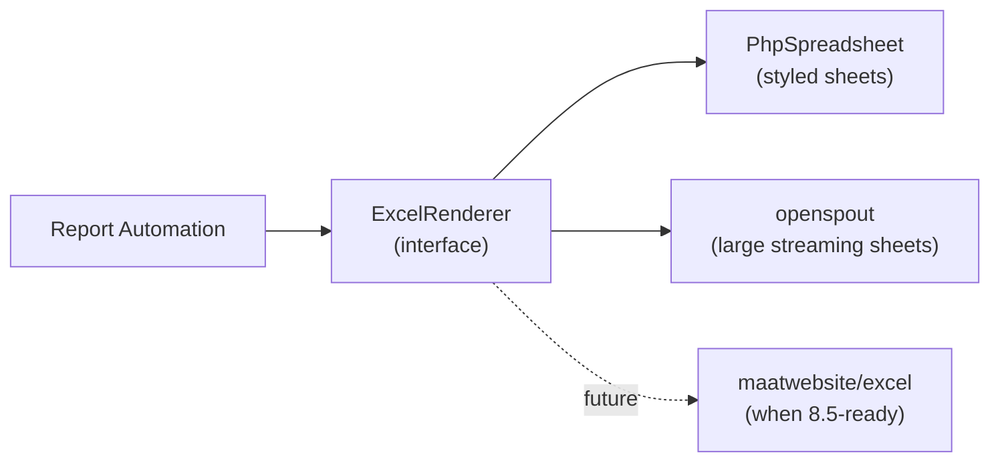

### 15.3 PDF Generation

- **DomPDF** for straightforward A4 management reports.
- **`spatie/laravel-pdf` (Browsershot/Chromium)** if pixel-accurate, chart-rich layouts are needed — render React/HTML to PDF for visual parity with the dashboard.

### 15.4 Frontend / npm Legacy Peer Deps

- Ant Design Pro + React toolchains often surface peer-dependency conflicts. Standardize on `npm install --legacy-peer-deps` (documented in the repo README and CI) to keep installs deterministic, matching the sister apps' setup.
- Pin Node and lockfile; use ProTable's server-side data source for all large financial grids.

### 15.5 Cross-Database Access in Laravel

- Define separate read-only DB connections (`arkfleet`, `daily_production`, `sarang_erp`) in `config/database.php`.
- Use dedicated read-only MySQL users (SELECT-only) — ArkaLedger must never write to sister databases.
- Wrap cross-app reads in thin repository classes so a future switch from shared-DB to REST is a one-file change.

### 15.6 Queues, Scheduling & Idempotency

- **Horizon on Redis** for imports, reconciliation, and rendering.
- **Idempotent imports:** upsert `account_balances` keyed on (period, site, account, source); track batches like `SapSyncRun`, and posting attempts like `SapPostingLog` with `idempotency_key` — reusing patterns already proven in `arkfleet-next`.
- **Scheduler** drives nightly SAP pulls, month-end reminders, due-date radar, and scheduled report delivery.

### 15.7 Security & Access Control

- **Spatie Permission** with per-site scoping: a site accountant sees only their site's P&L; managers see consolidated; auditors get read-only archive access.
- **Audit log** on every mutation (imports, approvals, locks, config changes) — non-negotiable for a CPA-grade system.
- Locked periods are immutable except via an audited admin reopen.
- Secrets (SAP credentials, Hermes tokens) in `.env` / a secrets manager, never in the repo.

### 15.8 Performance Notes

- Materialize `pnl_snapshots` on import so dashboards never aggregate on the fly for locked periods.
- Index `account_balances` on (report_period_id, project_site_id, account_id).
- Cache consolidated views in Redis, invalidated on import for open periods, permanent for locked periods.
- Stream large Excel/CSV exports; never build 65K rows in memory.

### 15.9 Version Control & Delivery

- **Private GitHub repo** (Iwan creates from laptop).
- Conventional commits, CI running on PHP 8.5 + Node with `--legacy-peer-deps`, and PR review before merge.
- Environment parity: dev matches the VPS (same MySQL/Redis versions) to avoid drift.

---

## Appendix A — Glossary

| Term | Meaning |
|------|---------|
| **P&L** | Profit & Loss statement |
| **CoA** | Chart of Accounts |
| **Cost IPH** | Cost grouping in the site P&L hierarchy |
| **PPN** | Pajak Pertambahan Nilai — Indonesian VAT |
| **PPh 21 / 23 / 25 / 4(2)** | Indonesian income-tax withholding categories |
| **SPT** | Surat Pemberitahuan — tax return filing |
| **NBV** | Net Book Value (asset depreciation) |
| **BCM** | Bank Cubic Meter (overburden removal volume) |
| **Stripping ratio** | Overburden removed per unit of coal produced |
| **Rincian** | Indonesian for "detail" — the detail sheets |
| **Hermes** | Existing email/WhatsApp/Telegram gateway |

## Appendix B — Canonical Project Sites

| Code | Description | Type |
|------|-------------|------|
| 017C | Coal Mining Site | Mining |
| 021C | Limestone & Shalestone Mining | Quarry |
| 022C | Mining Site | Mining |
| 023C | Mining Site | Mining |
| 025C | Mining Site | Mining |
| 026C | New Mining Site (started 2025) | Mining |
| APS | APS Business Unit (CHO region) | Services |
| HO | Head Office — Balikpapan | Admin |
| JKT | Jakarta Office | Admin |

---

*End of concept document — ArkaLedger v1.0. This is a product vision and architecture blueprint, not an implementation spec. Numbers in wireframes are illustrative. Final naming, SAP integration mechanism, and automation level pending stakeholder (Iwan) confirmation per §14.*


