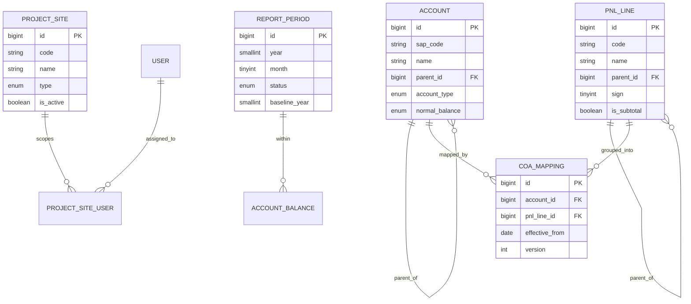
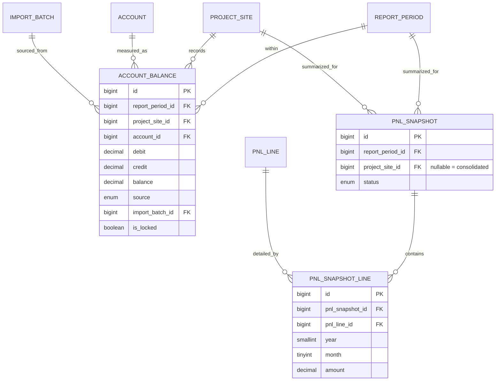
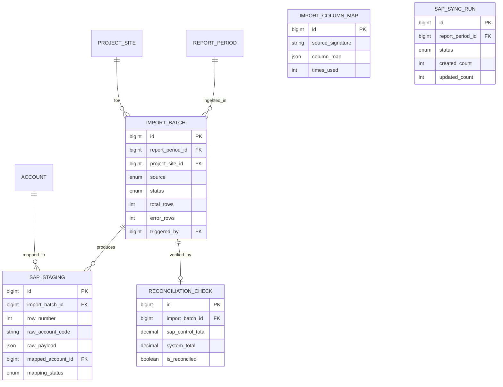
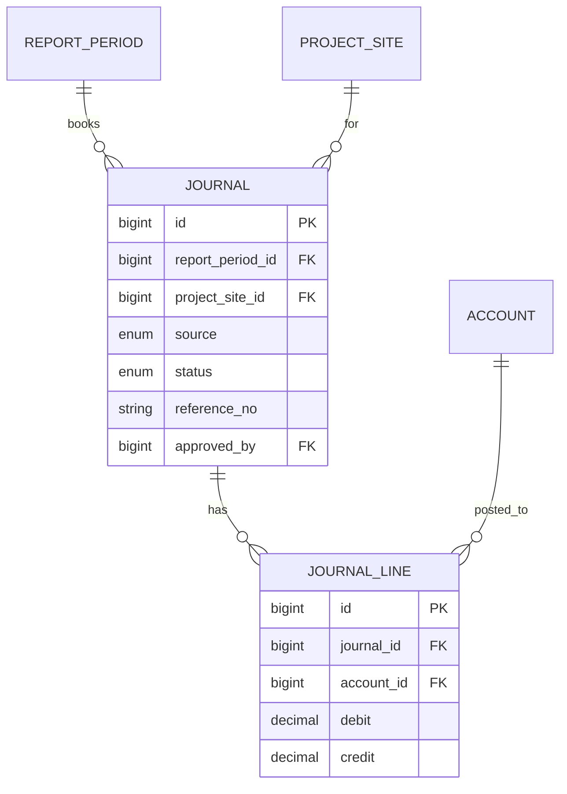
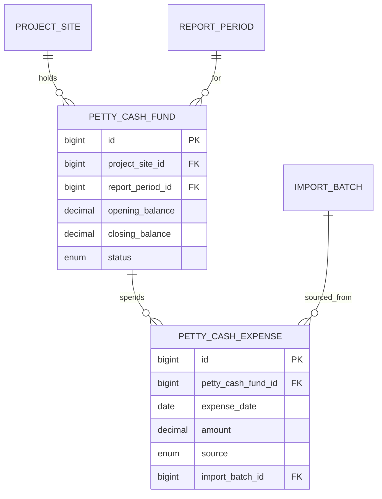
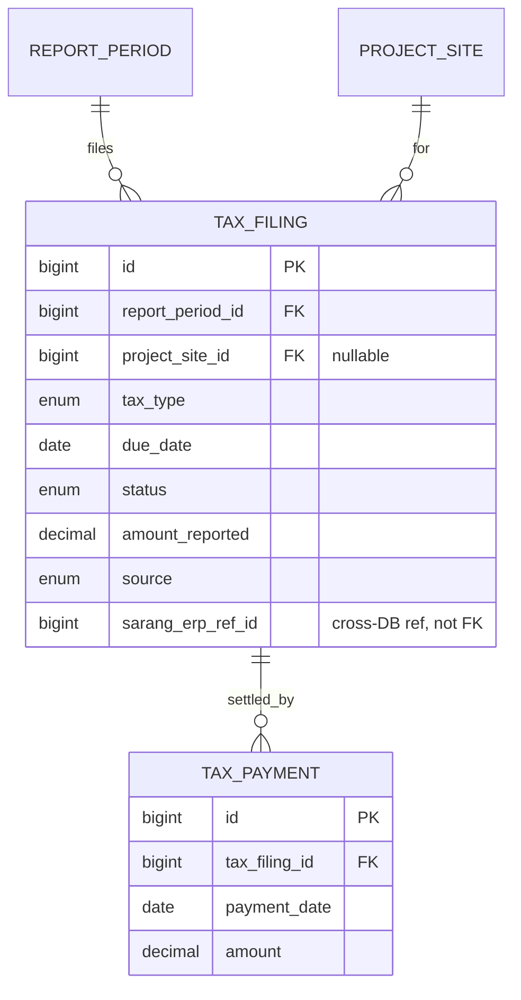
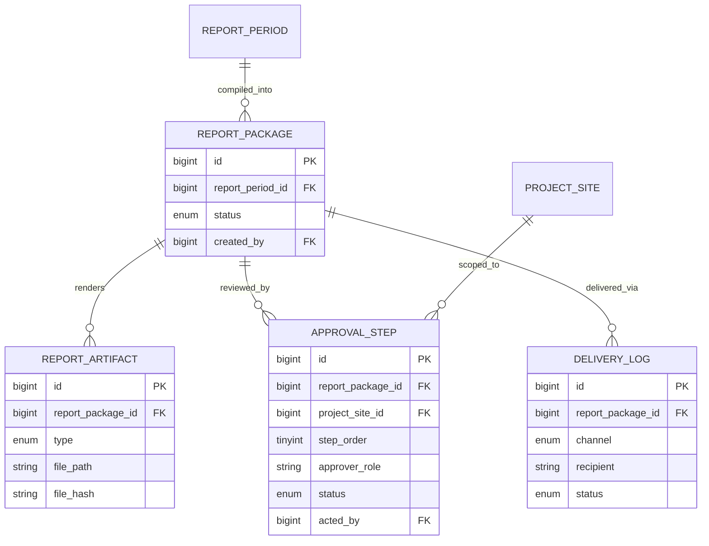
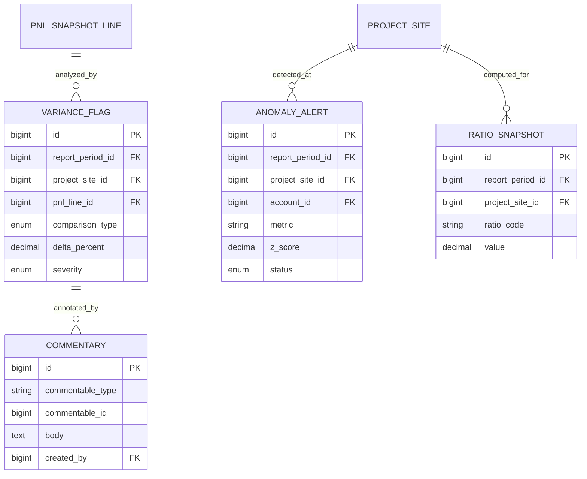
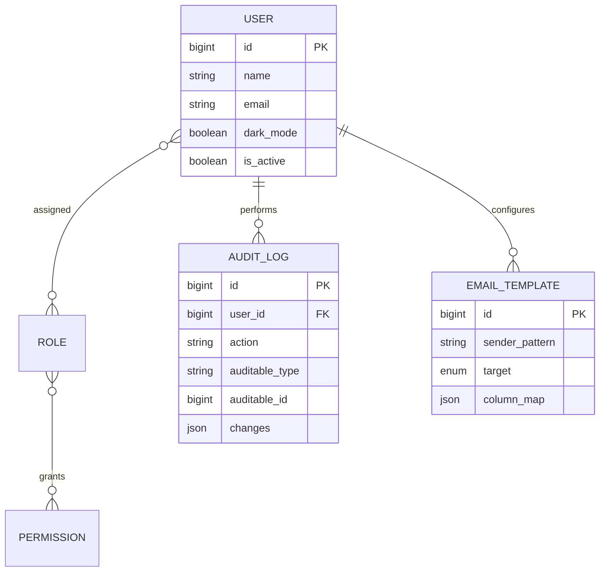
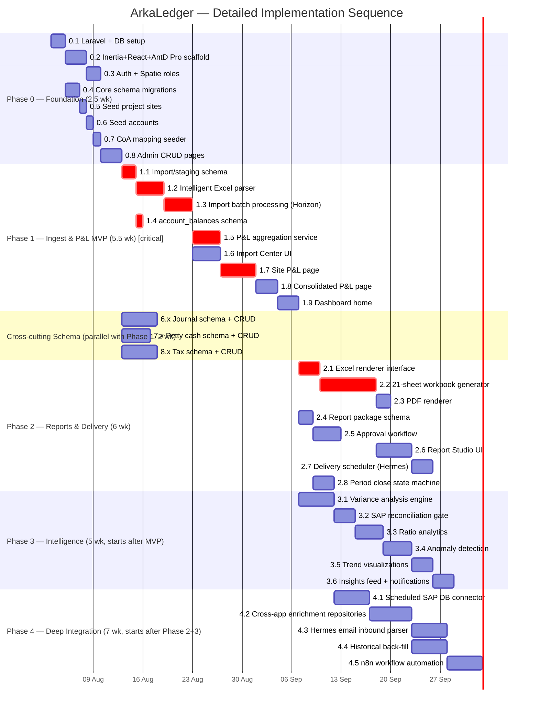

# ArkaLedger — Implementation Plan

## Engineering Build Plan (Concept → Code)

> **Project:** ArkaLedger (system) / FinSight (brand) — `rachmanj/inhouse-pnl`
> **Source of truth for vision:** [`docs/concept.md`](./concept.md) — this document does not re-litigate product decisions, it converts them into buildable steps.
> **Status:** Draft v1.0 — ready for Phase 0 kickoff
> **Database:** MySQL schema `inhouse_pnl`
> **Stack:** Laravel 13 + PHP 8.5 · Inertia.js + React + Ant Design Pro · Redis/Horizon · PhpSpreadsheet/openspout · DomPDF

---

## Table of Contents

1. [Phase 0 — Foundation & Scaffold](#1-phase-0--foundation--scaffold)
2. [Phase 1 — Data Ingestion & P&L Dashboard (MVP)](#2-phase-1--data-ingestion--pl-dashboard-mvp)
3. [Phase 2 — Reports & Delivery](#3-phase-2--reports--delivery)
4. [Phase 3 — Intelligence & Analytics](#4-phase-3--intelligence--analytics)
5. [Phase 4 — Deep Integration & Automation](#5-phase-4--deep-integration--automation)
6. [Journal Entry Module](#6-journal-entry-module)
7. [Petty Cash Module](#7-petty-cash-module)
8. [Tax Module](#8-tax-module)
9. [Complete Route Table](#9-complete-route-table)
10. [Complete Frontend Component Tree](#10-complete-frontend-component-tree)
11. [Conventions & Architecture](#11-conventions--architecture)
12. [ERD (Mermaid)](#12-erd-mermaid)
13. [Implementation Sequence (Gantt-style)](#13-implementation-sequence-gantt-style)

---

## 0. How This Plan Is Organized

- Journal Entry, Petty Cash, and Tax (Sections 6–8) are **cross-cutting modules**. Their schema/CRUD/UI land in **Phase 1–2** (they're needed for the 21-sheet Excel deliverable), while their *automation* (arkfleet depreciation pull, Hermes email ingest, sarang-erp reconciliation) lands in **Phase 4**. Section 13's Gantt chart shows the exact slot for every step.
- Every migration below is written as the literal `Schema::create` closure body to paste into the generated migration file. Column order matters for readability, not correctness.
- All money columns are `decimal(18,2)` (Rupiah, no fractional sen in practice, but 2dp kept for SAP fidelity).
- All tables live in the single `inhouse_pnl` MySQL database on the `mysql` (default) Laravel connection. Sister-app tables are **never migrated here** — they are queried through dedicated read-only connections (`arkfleet`, `daily_production`, `sarang_erp`), configured in [Section 11.5](#115-cross-database-connections).

---

## 1. Phase 0 — Foundation & Scaffold

**Goal:** A working Laravel app with auth, roles, and core reference schema ready to receive data. No business logic yet.

### Step 0.1 — Laravel Project Creation

```bash
composer create-project laravel/laravel inhouse-pnl "^13.0"
cd inhouse-pnl

# Core packages
composer require spatie/laravel-permission
composer require laravel/horizon
composer require phpoffice/phpspreadsheet
composer require openspout/openspout
composer require barryvdh/laravel-dompdf
composer require inertiajs/inertia-laravel

cp .env.example .env
php artisan key:generate
```

`.env` — database block:

```
DB_CONNECTION=mysql
DB_HOST=127.0.0.1
DB_PORT=3306
DB_DATABASE=inhouse_pnl
DB_USERNAME=inhouse_pnl_app
DB_PASSWORD=

QUEUE_CONNECTION=redis
REDIS_HOST=127.0.0.1
REDIS_PORT=6379
CACHE_STORE=redis
SESSION_DRIVER=database

# Read-only cross-app connections (Phase 4, defined now so config exists early)
ARKFLEET_DB_HOST=127.0.0.1
ARKFLEET_DB_DATABASE=arkfleet
ARKFLEET_DB_USERNAME=arkfleet_readonly
ARKFLEET_DB_PASSWORD=

DAILY_PRODUCTION_DB_HOST=127.0.0.1
DAILY_PRODUCTION_DB_DATABASE=daily_production
DAILY_PRODUCTION_DB_USERNAME=daily_production_readonly
DAILY_PRODUCTION_DB_PASSWORD=

SARANG_ERP_DB_HOST=127.0.0.1
SARANG_ERP_DB_DATABASE=sarang_erp
SARANG_ERP_DB_USERNAME=sarang_erp_readonly
SARANG_ERP_DB_PASSWORD=
```

Create the `inhouse_pnl` database and the four MySQL users (`inhouse_pnl_app` full rights on `inhouse_pnl` only; the three `*_readonly` users granted `SELECT`-only on their respective sister databases) before running migrations.

```bash
php artisan migrate:install
composer require laravel/horizon --dev=false
php artisan horizon:install
```

### Step 0.2 — Frontend Scaffold

```bash
composer require laravel/breeze --dev
php artisan breeze:install react
npm install --legacy-peer-deps

# Ant Design Pro stack on top of Breeze's React/Inertia skeleton
npm install --legacy-peer-deps antd @ant-design/pro-components @ant-design/pro-layout @ant-design/icons @ant-design/charts dayjs
```

Dark-mode-default `ProLayout` shell (matching the `hotel-resort-erp` convention):

- `resources/js/Layouts/ProLayout.jsx` — wraps Ant Design's `ProLayout`, sets `ConfigProvider` with `theme={{ algorithm: theme.darkAlgorithm }}` as the default, exposes a light/dark toggle stored in `localStorage` + a `dark_mode` column on `users` for persisted per-user preference (added in Step 0.4 users migration).
- `resources/js/Layouts/AuthenticatedLayout.jsx` — Breeze's default layout replaced to render `ProLayout` with the site menu (Dashboard, P&L, Import, Reports, Tax, Journals, Petty Cash, Admin) filtered by the current user's Spatie permissions (passed down via Inertia shared props from `HandleInertiaRequests` middleware).
- `resources/js/app.jsx` — Inertia root render wraps every page in `<ConfigProvider>` + `<ProLayout>` unless the page defines `Page.layout = null` (used for the login page).

`vite.config.js` — no changes beyond Breeze defaults; confirm `resolve.alias['@']` points to `resources/js`.

Run `npm run build` once scaffolding is done to catch any Vite/Rolldown import errors before moving on (per project convention).

### Step 0.3 — Auth System

```bash
php artisan vendor:publish --provider="Spatie\Permission\PermissionServiceProvider"
php artisan migrate
```

Register Spatie's `HasRoles` trait on `App\Models\User`. No new service provider — permission caching config lives in `config/permission.php`, published by the package itself.

**Seeded roles** (`database/seeders/RoleAndPermissionSeeder.php`, generated via `php artisan make:seeder RoleAndPermissionSeeder`):

| Role | Scope | Notes |
|------|-------|-------|
| `Super Admin` | All sites, all modules | Bypasses site-scoping via Gate::before |
| `Finance Manager` | All sites, read/write P&L, reports, approvals | Second-tier sign-off in approval workflow |
| `Site Accountant` | Own site(s) only (via `project_site_user` pivot) | Enters commentary, reviews own site P&L, first-tier approval |
| `Auditor` | All sites, read-only, locked periods only | Cannot see `open`/`in_review` periods |

**Permissions** (seeded as Spatie `Permission` records, grouped by module — full list also drives route middleware in [Section 9](#9-complete-route-table)):

```
sites.view, sites.manage
accounts.manage
coa-mappings.manage
periods.manage, periods.lock
pnl.view-own-site, pnl.view-all-sites
imports.create, imports.manage
journals.manage, journals.approve
pettycash.manage
tax.manage
reports.generate, reports.approve, reports.deliver
users.manage, roles.manage
```

`RoleAndPermissionSeeder` creates all permissions, then assigns them to the four roles per the table above (Super Admin gets `Permission::all()`).

Site scoping is implemented as a `project_site_user` pivot (see Step 0.4) plus an `App\Models\Concerns\ScopedToSites` trait applied to Eloquent models that carry a `project_site_id`, adding a global scope that restricts non-Super-Admin/non-Finance-Manager users to their assigned sites. A `Gate::before` in `AppServiceProvider::boot()` grants Super Admin all abilities.

### Step 0.4 — Core Schema Migrations

```bash
php artisan make:model ProjectSite -m
php artisan make:model Account -m
php artisan make:model CoaMapping -m
php artisan make:model ReportPeriod -m
php artisan make:migration add_profile_columns_to_users_table --table=users
php artisan make:migration create_project_site_user_table
```

**`project_sites`**

```php
Schema::create('project_sites', function (Blueprint $table) {
    $table->id();
    $table->string('code', 10)->unique();       // 017C, 021C, ..., HO, JKT
    $table->string('name');
    $table->enum('type', ['mining', 'quarry', 'services', 'admin']);
    $table->string('region')->nullable();        // e.g. "Kalimantan", "CHO"
    $table->boolean('is_active')->default(true);
    $table->unsignedSmallInteger('sort_order')->default(0);
    $table->timestamps();
});
```

**`accounts`**

```php
Schema::create('accounts', function (Blueprint $table) {
    $table->id();
    $table->string('sap_code', 20)->unique();    // 400, 51100, 51100002
    $table->string('name');
    $table->foreignId('parent_id')->nullable()->constrained('accounts')->nullOnDelete();
    $table->enum('account_type', [
        'revenue', 'backcharge', 'cost_of_sales', 'employee_expense',
        'admin_expense', 'depreciation', 'other',
    ]);
    $table->enum('normal_balance', ['debit', 'credit']);
    $table->unsignedTinyInteger('level')->default(0); // hierarchy depth, 0 = root
    $table->boolean('is_postable')->default(true);     // false for pure grouping accounts
    $table->unsignedSmallInteger('sort_order')->default(0);
    $table->timestamps();

    $table->index('account_type');
});
```

**`pnl_lines`** (the report hierarchy — independent of `accounts`, bridged via `coa_mappings`)

```php
Schema::create('pnl_lines', function (Blueprint $table) {
    $table->id();
    $table->string('code', 40)->unique();  // REVENUE_ENGINEERING, COST_OF_SALES_FUEL, PROFIT_LOSS
    $table->string('name');
    $table->foreignId('parent_id')->nullable()->constrained('pnl_lines')->nullOnDelete();
    $table->tinyInteger('sign')->default(1); // +1 adds to parent total, -1 subtracts (costs)
    $table->boolean('is_subtotal')->default(false); // true for computed rows (Cost IPH, Profit/Loss)
    $table->unsignedSmallInteger('sort_order')->default(0);
    $table->timestamps();
});
```

**`coa_mappings`**

```php
Schema::create('coa_mappings', function (Blueprint $table) {
    $table->id();
    $table->foreignId('account_id')->constrained()->cascadeOnDelete();
    $table->foreignId('pnl_line_id')->constrained()->cascadeOnDelete();
    $table->date('effective_from');
    $table->unsignedInteger('version')->default(1);
    $table->foreignId('created_by')->nullable()->constrained('users')->nullOnDelete();
    $table->timestamps();

    $table->unique(['account_id', 'effective_from'], 'coa_mappings_account_effective_unique');
    $table->index('pnl_line_id');
});
```

**`report_periods`**

```php
Schema::create('report_periods', function (Blueprint $table) {
    $table->id();
    $table->smallInteger('year');
    $table->tinyInteger('month');
    $table->enum('status', ['open', 'in_review', 'approved', 'delivered', 'locked'])
          ->default('open');
    $table->smallInteger('baseline_year')->default(2024);
    $table->timestamp('locked_at')->nullable();
    $table->foreignId('locked_by')->nullable()->constrained('users')->nullOnDelete();
    $table->timestamps();

    $table->unique(['year', 'month']);
});
```

**Extend `users`**

```php
Schema::table('users', function (Blueprint $table) {
    $table->boolean('dark_mode')->default(true)->after('password');
    $table->boolean('is_active')->default(true)->after('dark_mode');
});
```

**`project_site_user`** (site-scoping pivot — alphabetical table name per convention)

```php
Schema::create('project_site_user', function (Blueprint $table) {
    $table->id();
    $table->foreignId('project_site_id')->constrained()->cascadeOnDelete();
    $table->foreignId('user_id')->constrained()->cascadeOnDelete();
    $table->timestamps();

    $table->unique(['project_site_id', 'user_id']);
});
```

### Step 0.5 — Seed Project Sites

```bash
php artisan make:seeder ProjectSiteSeeder
```

`ProjectSiteSeeder` upserts (idempotent, keyed on `code`) all 9 canonical sites from `docs/concept.md` Appendix B:

| code | name | type | sort_order |
|------|------|------|-----------|
| 017C | Coal Mining Site | mining | 10 |
| 021C | Limestone & Shalestone Mining | quarry | 20 |
| 022C | Mining Site | mining | 30 |
| 023C | Mining Site | mining | 40 |
| 025C | Mining Site | mining | 50 |
| 026C | New Mining Site (2025) | mining | 60 |
| APS | APS Business Unit (CHO) | services | 70 |
| HO | Head Office — Balikpapan | admin | 80 |
| JKT | Jakarta Office | admin | 90 |

### Step 0.6 — Seed Accounts

```bash
php artisan make:seeder AccountSeeder
```

`AccountSeeder` builds the full P&L account hierarchy from `docs/concept.md` §Standard P&L Hierarchy, using `sap_code` as the idempotent upsert key and resolving `parent_id` via a code→id map built in-memory during the seeder run:

```
400                Revenue Invoices            revenue        credit  level 0
BACKCHARGE_FUEL    Backcharge Fuel             backcharge     credit  level 0
51100              Fuel                        cost_of_sales  debit   level 0
51100002           Fuel Transportation         cost_of_sales  debit   level 1 (parent: 51100)
51200              Lube                        cost_of_sales  debit   level 0
51300              Rental                      cost_of_sales  debit   level 0
51400              Blasting                    cost_of_sales  debit   level 0
51500              Safety                      cost_of_sales  debit   level 0
51600              Lab                         cost_of_sales  debit   level 0
51800              Insurance                   cost_of_sales  debit   level 0
51900              Spare Parts                 cost_of_sales  debit   level 0
EMP_EXP             Employee Expense            employee_expense debit level 0
ADMIN_SUPPLIES_IT   Admin / Supplies / IT       admin_expense    debit level 0
DEPR                Depreciation                depreciation     debit level 0
OTHER               Other Income/Expense        other            debit level 0
```

(`is_postable = false` for grouping-only rows if any are added later; all rows above are postable leaf/near-leaf accounts.)

### Step 0.7 — CoA Mapping Seeder

```bash
php artisan make:seeder PnlLineSeeder
php artisan make:seeder CoaMappingSeeder
```

`PnlLineSeeder` creates the report hierarchy (parent-first, using `code` as upsert key):

```
ROOT (sign +1, is_subtotal=false)
├─ REVENUE_ENGINEERING        sign +1
│  ├─ REVENUE                 sign +1
│  └─ BACKCHARGE_FUEL         sign +1
├─ COST_IPH                   sign -1  is_subtotal=true
│  └─ COST_OF_SALES           sign -1  is_subtotal=true
│     ├─ COST_FUEL            sign -1
│     │  └─ COST_FUEL_TRANSPORT  sign -1
│     ├─ COST_LUBE            sign -1
│     ├─ COST_RENTAL          sign -1
│     ├─ COST_BLASTING        sign -1
│     ├─ COST_SAFETY          sign -1
│     ├─ COST_LAB             sign -1
│     ├─ COST_INSURANCE       sign -1
│     └─ COST_SPARE_PARTS     sign -1
├─ EMPLOYEE_EXPENSE           sign -1
├─ ADMIN_SUPPLIES_IT          sign -1
├─ DEPRECIATION               sign -1
├─ OTHER                      sign -1
└─ PROFIT_LOSS                sign +1  is_subtotal=true  (computed: sum of ROOT's direct children × sign)
```

`CoaMappingSeeder` inserts the initial `account.sap_code → pnl_line.code` bridge, `effective_from = '2024-01-01'`, `version = 1`:

| sap_code | pnl_line code |
|----------|---------------|
| 400 | REVENUE |
| BACKCHARGE_FUEL | BACKCHARGE_FUEL |
| 51100 | COST_FUEL |
| 51100002 | COST_FUEL_TRANSPORT |
| 51200 | COST_LUBE |
| 51300 | COST_RENTAL |
| 51400 | COST_BLASTING |
| 51500 | COST_SAFETY |
| 51600 | COST_LAB |
| 51800 | COST_INSURANCE |
| 51900 | COST_SPARE_PARTS |
| EMP_EXP | EMPLOYEE_EXPENSE |
| ADMIN_SUPPLIES_IT | ADMIN_SUPPLIES_IT |
| DEPR | DEPRECIATION |
| OTHER | OTHER |

`DatabaseSeeder::run()` calls seeders in dependency order: `RoleAndPermissionSeeder → ProjectSiteSeeder → AccountSeeder → PnlLineSeeder → CoaMappingSeeder`.

### Step 0.8 — Admin CRUD Pages

```bash
php artisan make:controller Admin/ProjectSiteController --resource
php artisan make:controller Admin/AccountController --resource
php artisan make:controller Admin/CoaMappingController --resource
php artisan make:controller Admin/UserController --resource
php artisan make:controller Admin/RoleController --resource
php artisan make:request Admin/StoreProjectSiteRequest
php artisan make:request Admin/UpdateProjectSiteRequest
php artisan make:request Admin/StoreAccountRequest
php artisan make:request Admin/StoreCoaMappingRequest
php artisan make:request Admin/StoreUserRequest
```

| Controller | Methods | Middleware |
|---|---|---|
| `Admin\ProjectSiteController` | index, create, store, edit, update, destroy | `permission:sites.manage` |
| `Admin\AccountController` | index, create, store, edit, update, destroy | `permission:accounts.manage` |
| `Admin\CoaMappingController` | index, create, store, edit, update, destroy, `simulate` (mapping-simulator preview, POST, returns recomputed P&L preview JSON without persisting) | `permission:coa-mappings.manage` |
| `Admin\UserController` | index, create, store, edit, update, destroy, `assignSites` (attach/detach `project_site_user`) | `permission:users.manage` |
| `Admin\RoleController` | index, edit, update (permission checkboxes per role) | `permission:roles.manage` |

Inertia pages: `resources/js/Pages/Admin/ProjectSites/{Index,Form}.jsx`, `Admin/Accounts/{Index,Form}.jsx`, `Admin/CoaMappings/{Index,Form}.jsx`, `Admin/Users/{Index,Form}.jsx`, `Admin/Roles/{Index,Edit}.jsx` — all built on Ant Design Pro `ProTable` for the index views with inline edit/delete actions, and `ProForm` for create/edit.

**Phase 0 exit criteria:** `php artisan migrate:fresh --seed` runs clean; login works; a Super Admin can CRUD project sites, accounts, and CoA mappings; role-based menu visibility confirmed for all four roles.

---

## 2. Phase 1 — Data Ingestion & P&L Dashboard (MVP)

**Goal:** Upload a SAP export → parse, validate, normalize → live P&L dashboard per site and consolidated. This phase alone eliminates manual assembly (concept §13.2 MVP definition).

### Step 1.1 — Import/Staging Schema

```bash
php artisan make:model ImportBatch -m
php artisan make:model SapStagingRow -m
```

**`import_batches`**

```php
Schema::create('import_batches', function (Blueprint $table) {
    $table->id();
    $table->foreignId('report_period_id')->constrained()->cascadeOnDelete();
    $table->foreignId('project_site_id')->nullable()->constrained()->nullOnDelete();
    $table->enum('source', ['upload', 'sap_scheduled', 'service_layer', 'email'])->default('upload');
    $table->enum('status', [
        'pending', 'staged', 'mapped', 'validated', 'completed', 'failed',
    ])->default('pending');
    $table->string('original_filename')->nullable();
    $table->string('file_path')->nullable();
    $table->unsignedInteger('total_rows')->default(0);
    $table->unsignedInteger('staged_rows')->default(0);
    $table->unsignedInteger('mapped_rows')->default(0);
    $table->unsignedInteger('error_rows')->default(0);
    $table->json('error_summary')->nullable();
    $table->foreignId('triggered_by')->nullable()->constrained('users')->nullOnDelete();
    $table->timestamp('started_at')->nullable();
    $table->timestamp('completed_at')->nullable();
    $table->timestamps();

    $table->index(['report_period_id', 'project_site_id']);
    $table->index('status');
});
```

**`sap_staging`**

```php
Schema::create('sap_staging', function (Blueprint $table) {
    $table->id();
    $table->foreignId('import_batch_id')->constrained()->cascadeOnDelete();
    $table->unsignedInteger('row_number');
    $table->string('raw_account_code', 30)->nullable();
    $table->string('raw_account_name')->nullable();
    $table->decimal('raw_debit', 18, 2)->nullable();
    $table->decimal('raw_credit', 18, 2)->nullable();
    $table->decimal('raw_balance', 18, 2)->nullable();
    $table->json('raw_payload'); // full original row, exact source fidelity
    $table->foreignId('mapped_account_id')->nullable()->constrained('accounts')->nullOnDelete();
    $table->enum('mapping_status', ['unmapped', 'mapped', 'ambiguous', 'error'])->default('unmapped');
    $table->string('error_message')->nullable();
    $table->timestamps();

    $table->index(['import_batch_id', 'mapping_status']);
});
```

### Step 1.2 — Intelligent Excel Parser

```bash
mkdir -p app/Services/Import   # namespace only; classes created via touch through make below is unavailable for plain services, so create the file directly under this folder
php artisan make:test Services/Import/SapExcelParserServiceTest --unit
```

**`app/Services/Import/SapExcelParserService.php`**

```php
class SapExcelParserService
{
    public function detectLayout(string $filePath): ParsedLayout;   // finds header row + the "SAP" marker row per concept §5.2
    public function extractRows(string $filePath, ParsedLayout $layout): Collection; // raw rows as arrays
    public function guessColumnMap(ParsedLayout $layout): array;    // {account_code, account_name, debit, credit, balance} => column letter
}
```

- Reads via `PhpOffice\PhpSpreadsheet\IOFactory` (`->setReadDataOnly(true)` for performance).
- `detectLayout()` scans the first N rows for a cell matching `/^SAP$/i` or a known SAP export banner string — this is the "SAP marker row" from the concept doc — and treats the row immediately below it as the header row.
- `guessColumnMap()` uses fuzzy header matching (`Str::contains` on normalized headers: "account", "kode", "debit", "kredit", "saldo") plus a **learned-mapping cache** keyed by `(source_signature)` stored in a small `import_column_maps` table (see below) so repeat imports from the same site/template skip manual remapping — this realizes the concept's "Learning parser" innovation hook (§7.1).

**`import_column_maps`** (learning-parser cache, created alongside Step 1.1 migrations):

```php
Schema::create('import_column_maps', function (Blueprint $table) {
    $table->id();
    $table->string('source_signature', 64); // hash of header row text
    $table->json('column_map');             // {account_code: "A", debit: "C", ...}
    $table->unsignedInteger('times_used')->default(1);
    $table->timestamps();

    $table->unique('source_signature');
});
```

### Step 1.3 — Import Batch Processing

```bash
php artisan make:job StageImportBatchJob
php artisan make:job MapAndValidateImportBatchJob
php artisan make:job UpsertAccountBalancesJob
```

Horizon-queued pipeline (chained jobs, `Bus::chain`):

1. `StageImportBatchJob` — runs `SapExcelParserService`, inserts `sap_staging` rows, sets `import_batches.status = 'staged'`.
2. `MapAndValidateImportBatchJob` — resolves each staging row's `raw_account_code` to an `accounts.id` (exact `sap_code` match first, then a normalized/fuzzy fallback flagged `ambiguous` for manual review), sets `mapped_account_id` + `mapping_status`, updates batch counters, status `mapped` → `validated` once zero `unmapped` rows remain (or the user manually resolves ambiguous rows via the UI in Step 1.6).
3. `UpsertAccountBalancesJob` — for each validated staging row, upserts into `account_balances` keyed on `(report_period_id, project_site_id, account_id, source)` (idempotent — see [Section 11.6](#116-idempotent-import-pattern)), then dispatches `RecalculatePnlSnapshotJob` (Step 1.5) for the affected `(report_period_id, project_site_id)`. Sets `import_batches.status = 'completed'`.

`App\Actions\Import\ResolveAmbiguousMappingAction` — invoked from the Import Center UI when a CPA manually assigns an `unmapped`/`ambiguous` staging row to an account; re-dispatches `UpsertAccountBalancesJob` for just that batch.

### Step 1.4 — `account_balances` Schema

```bash
php artisan make:model AccountBalance -m
```

```php
Schema::create('account_balances', function (Blueprint $table) {
    $table->id();
    $table->foreignId('report_period_id')->constrained()->cascadeOnDelete();
    $table->foreignId('project_site_id')->constrained()->cascadeOnDelete();
    $table->foreignId('account_id')->constrained()->cascadeOnDelete();
    $table->decimal('debit', 18, 2)->default(0);
    $table->decimal('credit', 18, 2)->default(0);
    $table->decimal('balance', 18, 2)->default(0); // signed period movement
    $table->enum('source', ['sap', 'upload', 'email', 'sister_app'])->default('upload');
    $table->foreignId('import_batch_id')->nullable()->constrained()->nullOnDelete();
    $table->boolean('is_locked')->default(false);
    $table->timestamps();

    $table->unique(
        ['report_period_id', 'project_site_id', 'account_id', 'source'],
        'account_balances_period_site_account_source_unique'
    );
    $table->index(['report_period_id', 'project_site_id', 'account_id']);
});
```

### Step 1.5 — P&L Aggregation Service

```bash
php artisan make:model PnlSnapshot -m
php artisan make:model PnlSnapshotLine -m
php artisan make:job RecalculatePnlSnapshotJob
```

**`pnl_snapshots`**

```php
Schema::create('pnl_snapshots', function (Blueprint $table) {
    $table->id();
    $table->foreignId('report_period_id')->constrained()->cascadeOnDelete();
    $table->foreignId('project_site_id')->nullable()->constrained()->nullOnDelete(); // null = consolidated
    $table->enum('status', ['draft', 'final'])->default('draft');
    $table->timestamp('generated_at')->nullable();
    $table->foreignId('generated_by')->nullable()->constrained('users')->nullOnDelete();
    $table->timestamps();

    $table->unique(['report_period_id', 'project_site_id']);
});
```

**`pnl_snapshot_lines`** — one row per `(snapshot, pnl_line, year, month)`. TOTAL/AVG/% columns are **derived at query/render time**, not stored, since they are always computable from the 12 monthly rows and this avoids write-amplification on every re-aggregation.

```php
Schema::create('pnl_snapshot_lines', function (Blueprint $table) {
    $table->id();
    $table->foreignId('pnl_snapshot_id')->constrained()->cascadeOnDelete();
    $table->foreignId('pnl_line_id')->constrained()->cascadeOnDelete();
    $table->smallInteger('year');
    $table->tinyInteger('month');
    $table->decimal('amount', 18, 2)->default(0);
    $table->timestamps();

    $table->unique(
        ['pnl_snapshot_id', 'pnl_line_id', 'year', 'month'],
        'pnl_snapshot_lines_unique'
    );
});
```

**`app/Services/Pnl/PnlAggregationService.php`**

```php
class PnlAggregationService
{
    public function aggregateSite(ReportPeriod $period, ProjectSite $site): PnlSnapshot;
    public function aggregateConsolidated(ReportPeriod $period): PnlSnapshot; // sums across all active sites
    public function rollUp(PnlSnapshot $snapshot): void; // computes subtotal/parent pnl_lines bottom-up using pnl_lines.sign
    public function baselineVsCurrent(PnlSnapshot $current, int $baselineYear): array; // pairs current-year snapshot with the stored baseline-year snapshot for the same site
}
```

`RecalculatePnlSnapshotJob` invokes `aggregateSite()` (and `aggregateConsolidated()` when any site changes) whenever `account_balances` changes for an *open* period; it is a no-op (throws `PeriodLockedException`, caught and logged) for `locked` periods — enforcing immutability from concept §6.3.

### Step 1.6 — Import Center UI

```bash
php artisan make:controller Import/ImportBatchController --resource
```

| Method | Purpose |
|---|---|
| `index` | ProTable of batches: source, period, site, status chip, row counters, `triggered_by`, timestamps |
| `create` | Renders upload wizard shell |
| `store` | Step 1 of wizard — accepts file, creates `import_batches` row, dispatches `StageImportBatchJob` chain |
| `show` | Batch detail: staging rows ProTable with mapping_status filter, inline "assign account" action |
| `resolveMapping` | POST — calls `ResolveAmbiguousMappingAction` |
| `confirm` | Final wizard step — user confirms preview, triggers `UpsertAccountBalancesJob` |
| `destroy` | Soft-cancel a pending/failed batch |

Inertia pages:

- `resources/js/Pages/Import/Index.jsx` — ProTable, status chips (`pending`=default, `staged`=blue, `mapped`=cyan, `validated`=gold, `completed`=green, `failed`=red).
- `resources/js/Pages/Import/Create.jsx` — Ant Design Pro `ProForm` + `Steps` component: **Upload → Map → Preview → Confirm**. "Map" step shows the learned/guessed column map for the CPA to confirm/correct. "Preview" step shows staging rows grouped by `mapping_status` with a reconciliation summary (sum of staged debits/credits vs. an optional SAP control-total field the CPA can paste in).
- `resources/js/Pages/Import/Show.jsx` — staging row ProTable with per-row account reassignment drawer.

### Step 1.7 — Site P&L Page

```bash
php artisan make:controller Pnl/SitePnlController
```

| Method | Purpose |
|---|---|
| `show(ProjectSite $site, ReportPeriod $period)` | Returns baseline + current year `pnl_snapshot_lines` pivoted into the grid shape, plus hierarchy metadata from `pnl_lines` |
| `toggleView` | Query param `view=rincian|pnl` — same endpoint, `SitePnlPresenter` decides which `pnl_lines` levels to include (Rincian = all leaf accounts; P&L = subtotal/summary lines only) |

**`app/Services/Pnl/SitePnlPresenter.php`** — transforms two `PnlSnapshot`s (baseline year, current year) into the exact grid shape the frontend needs: `{ pnl_line, months: {jan..dec}, total, avg, percent_of_revenue }` for both year columns, per row, with `children[]` for expandable hierarchy.

Inertia page: `resources/js/Pages/Pnl/Site.jsx` — Ant Design Pro `ProTable` configured with:
- frozen (`fixed: 'left'`) account-hierarchy column,
- two column groups (`children` columns) titled `{baseline_year} (baseline)` and `{current_year} (current)`, each with Jan–Dec + TOTAL/AVG/% sub-columns,
- `expandable` row config driven by `pnl_lines.parent_id` nesting,
- a `Segmented` control for the Rincian ↔ P&L view toggle (re-fetches via Inertia partial reload on `view` prop change, no full page reload).

### Step 1.8 — Consolidated P&L Page

```bash
php artisan make:controller Pnl/ConsolidatedPnlController
```

| Method | Purpose |
|---|---|
| `show(ReportPeriod $period)` | Consolidated `pnl_snapshot` (site_id = null) + per-site contribution breakdown |
| `excludeSite` | Query param `exclude_sites[]=026C` — recomputes consolidated total on the fly (in-memory, not persisted) for the "what-if exclusion" innovation hook (concept §7.4) |

Inertia page: `resources/js/Pages/Pnl/Consolidated.jsx` — same `ProTable` grid as Site P&L, plus an Ant Design Charts stacked bar showing each site's revenue/cost contribution, and site-exclusion checkboxes above the chart.

### Step 1.9 — Dashboard Home

```bash
php artisan make:controller DashboardController
```

`DashboardController@index(ReportPeriod $period = null)` — defaults to the latest `open`/`in_review` period; returns:
- KPI aggregates (Revenue, Cost IPH, Net P&L, vs-baseline %) computed from the consolidated `pnl_snapshot`,
- 24-month trend series (current + baseline year) for the headline chart,
- placeholder insights feed (real variance/anomaly flags arrive in Phase 3 — Step 1.9 ships the feed UI reading an empty/seeded `variance_flags` table stub if Phase 3 hasn't landed yet),
- site status board reading `report_periods` + a per-site `pnl_snapshots.status`.

Inertia page: `resources/js/Pages/Dashboard/Index.jsx` — KPI `ProCard`s, Ant Design Charts `Line` for the trend, `Column`/stacked bar for per-site contribution, two-column layout for Insights Feed + Site Status Board (per concept §9.1 wireframe).

**Phase 1 exit criteria:** CPA uploads a real SAP export for one site, resolves any ambiguous mappings, confirms the import, and immediately sees an accurate Site P&L and Consolidated P&L on screen matching the source Excel's numbers — the MVP ROI moment.

---

## 3. Phase 2 — Reports & Delivery

**Goal:** Faithfully regenerate the 21-sheet Excel workbook, add PDF, approval workflow, and scheduled delivery.

### Step 2.1 — Excel Renderer Service

```bash
php artisan make:interface Services/Reports/ExcelRendererInterface   # Laravel 13 supports make:interface
```

**`app/Services/Reports/ExcelRendererInterface.php`**

```php
interface ExcelRendererInterface
{
    public function newWorkbook(): void;
    public function addSheet(string $name, SheetDefinition $definition): void;
    public function save(string $path): string; // returns absolute path
}
```

Implementations:

- `app/Services/Reports/PhpSpreadsheetExcelRenderer.php` — default for all styled sheets (merged headers, 2024/current column groups, computed TOTAL/AVG/% columns, cell coloring for variance flags in Phase 3).
- `app/Services/Reports/OpenSpoutExcelRenderer.php` — used specifically for the SPT & PAYMENT sheet (65K+ rows) via streaming writes; selected by `WorkbookGeneratorService` per-sheet based on a `SheetDefinition::$engine` hint (`'styled'` vs `'streaming'`).

`app/Services/Reports/SheetDefinition.php` — value object: `{ name, headerRows, columnGroups, dataRows, totalsRow, engine }`, consumed identically by both renderer implementations so callers never know which engine rendered a given sheet.

### Step 2.2 — 21-Sheet Workbook Generator

```bash
php artisan make:class Services/Reports/WorkbookGeneratorService
php artisan make:class Services/Reports/Sheets/JournalEntrySheetBuilder
php artisan make:class Services/Reports/Sheets/PettyCashSummarySheetBuilder
php artisan make:class Services/Reports/Sheets/SptPaymentSheetBuilder
php artisan make:class Services/Reports/Sheets/MonthlyTaxReportSheetBuilder
php artisan make:class Services/Reports/Sheets/RincianSheetBuilder
php artisan make:class Services/Reports/Sheets/PnlSheetBuilder
php artisan make:class Services/Reports/Sheets/SummaryPnlSheetBuilder
```

Each `*SheetBuilder` implements `app/Services/Reports/Sheets/SheetBuilderInterface { build(ReportPeriod $period, ?ProjectSite $site = null): SheetDefinition }`. `RincianSheetBuilder` and `PnlSheetBuilder` are **parameterized by site** and invoked once per site (017C, 021C, 022C, 023C, 025C, 026C, APS, HO&JKT) to produce the 16 per-site Rincian/P&L sheets; `SummaryPnlSheetBuilder` produces the 1 consolidated sheet.

`WorkbookGeneratorService::generate(ReportPackage $package): ReportArtifact` orchestrates the full 21-sheet map from concept §10.2:

| # | Sheet | Builder | Data source |
|---|-------|---------|-------------|
| 1 | JOURNAL ENTRY | `JournalEntrySheetBuilder` | `journals` + `journal_lines` (Section 6) |
| 2 | PETTY CASH SUMMARY | `PettyCashSummarySheetBuilder` | `petty_cash_funds` + `petty_cash_expenses` (Section 7) |
| 3 | SPT & PAYMENT | `SptPaymentSheetBuilder` (openspout, streaming) | `tax_filings` + `tax_payments` (Section 8) |
| 4 | MONTHLY TAX REPORT | `MonthlyTaxReportSheetBuilder` | tax module aggregation |
| 5–9 | Rincian 017C/021C/022C/025C/026C | `RincianSheetBuilder` × site | `pnl_snapshot_lines` (leaf detail) |
| 10–13 | P&L 017C/021C/022C/025C | `PnlSheetBuilder` × site | `pnl_snapshot_lines` (subtotal view) |
| 14–15 | Rincian / P&L APS | `RincianSheetBuilder`/`PnlSheetBuilder` (site=APS) | site snapshot |
| 16–17 | Rincian / P&L HO & JKT | same builders (site=HO, site=JKT, rendered side-by-side per concept sheet naming) | site snapshot |
| 18 | SUMMARY P&L | `SummaryPnlSheetBuilder` | consolidated `pnl_snapshot` |
| 19–20 | Rincian / P&L 026C | `RincianSheetBuilder`/`PnlSheetBuilder` (site=026C) | site snapshot |
| 21 | Rincian / P&L 023C | `RincianSheetBuilder`/`PnlSheetBuilder` (site=023C) | site snapshot |

Merged headers, the two year-column groups, and computed TOTAL/AVG/% columns are handled generically inside `PhpSpreadsheetExcelRenderer::addSheet()` from the `SheetDefinition::$columnGroups` structure, so individual builders only need to supply raw row data — the layout logic is written once.

### Step 2.3 — PDF Renderer

```bash
php artisan make:class Services/Reports/PdfReportRenderer
```

`PdfReportRenderer::render(ReportPackage $package): ReportArtifact` uses `barryvdh/laravel-dompdf` against a Blade view `resources/views/reports/pdf/monthly-report.blade.php` (A4, running header with period + company, footer with page numbers + generation timestamp), summarizing the consolidated P&L and per-site highlights (not a full 21-sheet replica — PDF is the executive-readable companion to the Excel workbook of record).

### Step 2.4 — Report Package Schema

```bash
php artisan make:model ReportPackage -m
php artisan make:model ReportArtifact -m
php artisan make:model ApprovalStep -m
```

**`report_packages`**

```php
Schema::create('report_packages', function (Blueprint $table) {
    $table->id();
    $table->foreignId('report_period_id')->constrained()->cascadeOnDelete();
    $table->enum('status', ['draft', 'in_review', 'approved', 'delivered'])->default('draft');
    $table->foreignId('created_by')->nullable()->constrained('users')->nullOnDelete();
    $table->timestamps();
});
```

**`report_artifacts`**

```php
Schema::create('report_artifacts', function (Blueprint $table) {
    $table->id();
    $table->foreignId('report_package_id')->constrained()->cascadeOnDelete();
    $table->enum('type', ['excel', 'pdf']);
    $table->string('file_path');
    $table->string('file_hash', 64); // sha256, for delivery audit trail
    $table->timestamp('generated_at');
    $table->timestamps();
});
```

**`approval_steps`**

```php
Schema::create('approval_steps', function (Blueprint $table) {
    $table->id();
    $table->foreignId('report_package_id')->constrained()->cascadeOnDelete();
    $table->foreignId('project_site_id')->nullable()->constrained()->nullOnDelete(); // null = final consolidated sign-off
    $table->unsignedTinyInteger('step_order');
    $table->string('approver_role'); // Spatie role name required to act on this step
    $table->enum('status', ['pending', 'approved', 'rejected'])->default('pending');
    $table->foreignId('acted_by')->nullable()->constrained('users')->nullOnDelete();
    $table->timestamp('acted_at')->nullable();
    $table->text('comments')->nullable(); // required when status = rejected
    $table->timestamps();

    $table->index(['report_package_id', 'status']);
});
```

### Step 2.5 — Approval Workflow

```bash
php artisan make:controller Reports/ApprovalStepController
php artisan make:class Actions/Reports/RejectApprovalStepAction
php artisan make:class Actions/Reports/ApproveApprovalStepAction
```

Kanban columns map directly to `approval_steps.status` (`pending` → Draft/In Review depending on `report_packages.status`, `approved` → Approved). `RejectApprovalStepAction` requires non-empty `comments` (enforced in `RejectApprovalStepRequest` FormRequest) and transitions the parent `report_packages.status` back to `draft`. `ApproveApprovalStepAction` advances `step_order`; when the final (consolidated) step is approved, `report_packages.status = 'approved'` and the parent `report_periods.status` transitions to `approved` via `PeriodStateService` (Step 2.8).

### Step 2.6 — Report Studio UI

```bash
php artisan make:controller Reports/ReportPackageController --resource
```

| Method | Purpose |
|---|---|
| `index` | List packages by period |
| `create` / `store` | Package builder: select period, sites, sections → creates `report_packages` + seeds `approval_steps` (one per active site + one final consolidated step) |
| `show` | Preview tabs (one per sheet, rendered from live `pnl_snapshot` data before committing to a file) + approval board + delivery controls |
| `generate` | POST — dispatches `GenerateReportArtifactsJob` (Horizon) invoking `WorkbookGeneratorService` + `PdfReportRenderer` |

Inertia pages: `resources/js/Pages/Reports/Index.jsx`, `Reports/Builder.jsx` (period/site/section `ProForm` selector), `Reports/Studio.jsx` (Tabs for the 21 sheet previews + `Reports/ApprovalBoard.jsx` kanban component + `Reports/DeliveryPanel.jsx`).

### Step 2.7 — Delivery Scheduler

```bash
php artisan make:model DeliveryLog -m
php artisan make:job DeliverReportPackageJob
php artisan make:class Services/Hermes/HermesClient
```

**`delivery_logs`**

```php
Schema::create('delivery_logs', function (Blueprint $table) {
    $table->id();
    $table->foreignId('report_package_id')->constrained()->cascadeOnDelete();
    $table->enum('channel', ['email', 'whatsapp', 'telegram']);
    $table->string('recipient');
    $table->string('artifact_hash', 64);
    $table->enum('status', ['queued', 'sent', 'failed'])->default('queued');
    $table->text('error_message')->nullable();
    $table->timestamp('sent_at')->nullable();
    $table->timestamps();
});
```

`HermesClient::sendEmail()`, `sendWhatsApp()`, `sendTelegram()` wrap Hermes gateway HTTP calls (base URL + token in `config/services.php['hermes']`). `DeliverReportPackageJob` is dispatched either manually (CPA clicks Send in `Reports/DeliveryPanel.jsx`) or by the scheduler (`app/Console/Kernel.php` → `$schedule->job(...)->monthlyOn(...)`) when a package's period has `report_periods.status = 'approved'` and no open `variance_flags`/`anomaly_alerts` (the "lights-out auto-send" policy from concept §10.4), configurable per period via a `report_periods.auto_deliver` boolean (add via a small follow-up migration in this step).

### Step 2.8 — Period Close State Machine

```bash
php artisan make:class Services/Periods/PeriodStateService
php artisan make:enum Enums/ReportPeriodStatus
```

`Enums/ReportPeriodStatus` — backed enum: `Open`, `InReview`, `Approved`, `Delivered`, `Locked`.

`PeriodStateService::transition(ReportPeriod $period, ReportPeriodStatus $to, User $actor): void` — enforces the allowed-transition matrix from concept §8.2:

```
Open      -> InReview
InReview  -> Open (rejection), Approved
Approved  -> Delivered
Delivered -> Locked
Locked    -> InReview (admin reopen, requires permission "periods.lock" + writes an audit_logs row)
```

Locking (`Locked`) sets `account_balances.is_locked = true` and `pnl_snapshots.status = 'final'` for every row in that period (bulk update in a transaction) — freezing the immutable archive. Any other transition attempt throws `InvalidPeriodTransitionException`, rendered as a 422 with a user-facing message on the Inertia side and logged to `audit_logs` (Section 11) either way.

`Admin\ReportPeriodController@transition` (new controller, `php artisan make:controller Admin/ReportPeriodController`) exposes this as `PATCH /admin/report-periods/{reportPeriod}/status`.

**Phase 2 exit criteria:** For an approved period, clicking "Generate" in Report Studio produces a 21-sheet Excel file and a PDF that a CPA confirms matches the legacy manual workbook's structure and totals; approval board correctly gates generation; locking a period freezes its numbers.

---

## 4. Phase 3 — Intelligence & Analytics

**Goal:** Variance analysis, SAP reconciliation gate, ratio analytics, anomaly detection — the *inovasi* layer (concept §11).

### Step 3.1 — Variance Analysis Engine

```bash
php artisan make:model VarianceFlag -m
php artisan make:class Services/Intelligence/VarianceAnalysisService
```

**`variance_flags`**

```php
Schema::create('variance_flags', function (Blueprint $table) {
    $table->id();
    $table->foreignId('report_period_id')->constrained()->cascadeOnDelete();
    $table->foreignId('project_site_id')->constrained()->cascadeOnDelete();
    $table->foreignId('pnl_line_id')->constrained()->cascadeOnDelete();
    $table->enum('comparison_type', ['yoy', 'mom', 'budget']);
    $table->decimal('delta_absolute', 18, 2);
    $table->decimal('delta_percent', 8, 2);
    $table->enum('severity', ['info', 'warning', 'critical'])->default('info');
    $table->boolean('is_acknowledged')->default(false);
    $table->timestamps();

    $table->index(['report_period_id', 'project_site_id', 'severity']);
});
```

`VarianceAnalysisService::analyze(PnlSnapshot $snapshot): Collection` computes, per `pnl_snapshot_line`: YoY delta (vs. baseline-year snapshot), MoM delta (vs. prior month's snapshot line), and budget delta (vs. `MonthlyPlan`/`PlanTarget` pulled read-only from `daily-production`, Step 4.2, or an admin-entered budget stored in a small `budget_targets` table). A `VarianceThresholdConfig` (config file `config/intelligence.php`, materiality-aware: percentage threshold scales down for large accounts) decides whether a computed delta is promoted to a `variance_flags` row. Dispatched from `RecalculatePnlSnapshotJob` (Step 1.5) as a follow-up job `AnalyzeVarianceJob` so every re-aggregation refreshes variance state.

Inline grid coloring: `SitePnlPresenter` (Step 1.7) joins `variance_flags` into its output so `Pnl/Site.jsx` can apply red/green cell backgrounds and directional arrows without a second request.

### Step 3.2 — SAP Reconciliation Gate

```bash
php artisan make:model ReconciliationCheck -m
php artisan make:class Services/Intelligence/ReconciliationService
```

**`reconciliation_checks`**

```php
Schema::create('reconciliation_checks', function (Blueprint $table) {
    $table->id();
    $table->foreignId('import_batch_id')->constrained()->cascadeOnDelete();
    $table->decimal('sap_control_total', 18, 2)->nullable(); // CPA-entered or pulled from SAP control report
    $table->decimal('system_total', 18, 2);                  // sum of resulting account_balances
    $table->decimal('discrepancy', 18, 2);
    $table->boolean('is_reconciled')->default(false);
    $table->json('discrepancy_detail')->nullable(); // itemized by account
    $table->timestamps();
});
```

`ReconciliationService::check(ImportBatch $batch): ReconciliationCheck` — run automatically at the end of `UpsertAccountBalancesJob` (Step 1.3). `PeriodStateService::transition()` (Step 2.8) is extended here to **reject** an `Open → InReview` transition if any of the period's import batches has `is_reconciled = false` — the reconciliation gate from concept §11.5.

### Step 3.3 — Ratio Analytics

```bash
php artisan make:model RatioSnapshot -m
php artisan make:class Services/Intelligence/RatioAnalyticsService
php artisan make:class Repositories/DailyProductionRepository
```

**`ratio_snapshots`**

```php
Schema::create('ratio_snapshots', function (Blueprint $table) {
    $table->id();
    $table->foreignId('report_period_id')->constrained()->cascadeOnDelete();
    $table->foreignId('project_site_id')->constrained()->cascadeOnDelete();
    $table->string('ratio_code', 40); // COST_REVENUE, FUEL_EFFICIENCY, STRIPPING_RATIO, FUEL_COST_PER_TON, DEPR_INTENSITY, GROSS_MARGIN
    $table->decimal('value', 14, 4);
    $table->timestamp('computed_at');
    $table->timestamps();

    $table->unique(['report_period_id', 'project_site_id', 'ratio_code']);
});
```

`RatioAnalyticsService::computeForSite(ReportPeriod $period, ProjectSite $site): void` implements the six ratios from concept §11.3, pulling `ProductionRecord`/`FuelRecord` via `DailyProductionRepository` (read-only `daily_production` connection, see [Section 11.5](#115-cross-database-connections)) joined to the local `account_balances` via the `project_sites` ↔ `ProjectSiteMapping` crosswalk.

### Step 3.4 — Anomaly Detection

```bash
php artisan make:model AnomalyAlert -m
php artisan make:class Services/Intelligence/AnomalyDetectionService
```

**`anomaly_alerts`**

```php
Schema::create('anomaly_alerts', function (Blueprint $table) {
    $table->id();
    $table->foreignId('report_period_id')->constrained()->cascadeOnDelete();
    $table->foreignId('project_site_id')->constrained()->cascadeOnDelete();
    $table->foreignId('account_id')->nullable()->constrained()->nullOnDelete();
    $table->string('metric'); // e.g. "fuel_cost"
    $table->decimal('observed_value', 18, 4);
    $table->decimal('expected_value', 18, 4);
    $table->decimal('z_score', 8, 4)->nullable();
    $table->text('explanation'); // human-readable: "+42% fuel cost, but OB removal only +3%"
    $table->enum('status', ['open', 'acknowledged', 'dismissed'])->default('open');
    $table->timestamps();

    $table->index(['report_period_id', 'project_site_id', 'status']);
});
```

`AnomalyDetectionService::scan(ReportPeriod $period): void` — rolling mean ± kσ (z-score, trailing 12 months of `account_balances`) per `account × site`; for cost accounts with a known operational driver (Fuel → OB removal BCM via `RatioAnalyticsService`), cross-checks the ratio-aware condition from concept §11.2 before flagging, and writes a human-readable `explanation` string.

### Step 3.5 — Trend Visualizations

No new backend schema — `app/Services/Intelligence/TrendSeriesService::buildSeries(pnlLineId, siteId, months = 24): array` reads `pnl_snapshot_lines` across periods.

Frontend: `resources/js/Components/Charts/TrendLine.jsx` (Ant Design Charts `Line`, 24-month current+baseline overlay), `Charts/SmallMultiples.jsx` (per-account grid of mini line charts, per concept §11.4), `Charts/SeasonalityOverlay.jsx` (wet/dry season shading band).

### Step 3.6 — Insights Feed + Notifications

```bash
php artisan make:controller Intelligence/InsightsController
php artisan make:job NotifyInsightJob
```

`InsightsController@index(ReportPeriod $period)` — merges `variance_flags` (severity ≥ warning) + `anomaly_alerts` (status = open) + reconciliation failures into a single feed, sorted by severity/recency, for `Dashboard/Index.jsx`'s Insights Feed panel and a dedicated `resources/js/Pages/Intelligence/Insights.jsx` full-list page.

`NotifyInsightJob` — dispatched whenever `AnomalyDetectionService` or `ReconciliationService` produces a `critical`/failed result; calls `HermesClient::sendWhatsApp()`/`sendTelegram()` per concept §11.8.

**Phase 3 exit criteria:** Uploading a period with an artificially inflated fuel cost produces a visible anomaly alert with a correct explanation string, a red-colored P&L cell, and (if configured) a WhatsApp notification; an unreconciled import blocks the period from entering `InReview`.

---

## 5. Phase 4 — Deep Integration & Automation

**Goal:** Scheduled SAP pulls, cross-app enrichment, email parsing, historical back-fill, n8n orchestration.

### Step 4.1 — Scheduled SAP DB Connector

```bash
php artisan make:class Services/Sap/SapAccountBalanceSyncService
php artisan make:model SapSyncRun -m
php artisan make:job ScheduledSapPullJob
```

**`sap_sync_runs`** (mirrors the proven `arkfleet-next` pattern per concept §5.2/§15.6):

```php
Schema::create('sap_sync_runs', function (Blueprint $table) {
    $table->id();
    $table->foreignId('report_period_id')->constrained()->cascadeOnDelete();
    $table->enum('status', ['running', 'completed', 'failed'])->default('running');
    $table->unsignedInteger('created_count')->default(0);
    $table->unsignedInteger('updated_count')->default(0);
    $table->unsignedInteger('failed_count')->default(0);
    $table->text('error_summary')->nullable();
    $table->string('triggered_by')->default('scheduler'); // 'scheduler' or a user id string
    $table->timestamp('started_at');
    $table->timestamp('completed_at')->nullable();
    $table->timestamps();
});
```

`SapAccountBalanceSyncService::pull(ReportPeriod $period): SapSyncRun` — read-only query against the SAP company DB (`OACT` chart of accounts, `JDT1`/`OJDT` journal detail/header, `PRC1` cost centers) over the `sap` connection (config in [Section 11.5](#115-cross-database-connections)), mapped through the same `CoaMappingResolver` used by the file-upload path, and upserted into `account_balances` with `source = 'sap'` — fully idempotent on the existing unique key. `ScheduledSapPullJob` is registered nightly in `routes/console.php` (Laravel 11+ convention — no `Kernel.php`): `Schedule::job(new ScheduledSapPullJob)->dailyAt('02:00')`.

### Step 4.2 — Cross-App Data Enrichment

```bash
php artisan make:class Repositories/ArkfleetRepository
php artisan make:class Repositories/SarangErpRepository
```

(`DailyProductionRepository` already created in Step 3.3.)

| Repository | Reads (read-only connection) | Consumed by |
|---|---|---|
| `ArkfleetRepository` | `DepreciationEntry`, `Equipment`, `EquipmentHmKmReading`, `Project` | `DepreciationJournalBuilderService` (Section 6) |
| `DailyProductionRepository` | `FuelRecord`, `ProductionRecord`, `EquipmentDeployment`, `MonthlyPlan`, `PlanTarget`, `Site`/`ProjectSiteMapping` | `RatioAnalyticsService`, `AnomalyDetectionService`, `VarianceAnalysisService` (budget axis) |
| `SarangErpRepository` | `TaxReport`, `TaxTransaction`, `TaxPeriod`, `AssetDepreciationRun` | `TaxReconciliationService` (Section 8) |

Each repository is a thin read-only query wrapper (no Eloquent models writing to sister DBs — plain `DB::connection('arkfleet')->table(...)` queries or minimal read-only Eloquent models with `protected $connection` and no `save()`/`create()` usage anywhere in ArkaLedger code, enforced by code review + the security-review skill).

### Step 4.3 — Hermes Email Inbound Parser

```bash
php artisan make:controller Api/HermesInboundController
php artisan make:model EmailTemplate -m
php artisan make:class Services/Hermes/EmailTemplateClassifier
php artisan make:class Services/Hermes/PettyCashEmailParser
```

**`email_templates`** (the "teaches a new template" mechanism from concept §5.5):

```php
Schema::create('email_templates', function (Blueprint $table) {
    $table->id();
    $table->string('sender_pattern'); // email or domain match
    $table->string('subject_pattern')->nullable();
    $table->enum('target', ['petty_cash', 'supporting_schedule']);
    $table->json('column_map'); // reuses the same shape as import_column_maps
    $table->timestamps();
});
```

`Api\HermesInboundController@handle` — webhook endpoint Hermes POSTs to on new inbox mail; `EmailTemplateClassifier::classify($payload): ?EmailTemplate` matches sender/subject; known templates flow straight to `PettyCashEmailParser::parse()` → stages into `petty_cash_expenses` (`source = 'email_import'`); unknown layouts are stored as a `pending` `import_batches` row (`source = 'email'`) surfaced in the Import Center for manual mapping, which then creates a new `email_templates` row for next time.

### Step 4.4 — Historical Data Back-Fill

```bash
php artisan make:command Arkaledger/BackfillBaseline
php artisan make:command Arkaledger/ImportSptHistory
```

`php artisan arkaledger:backfill-baseline {--year=2024} {--path=}` — batch-runs the Phase 1 import pipeline (Steps 1.2–1.4) against a directory of historical per-site Excel exports for the baseline year, tagging every resulting `account_balances` row `source = 'upload'` and immediately locking the resulting periods (`PeriodStateService::transition(..., Locked)`) since baseline data is reference-only and must never drift.

`php artisan arkaledger:import-spt-history {--from=2017} {--to=2026} {--path=}` — streams historical SPT rows (60K+) directly into `tax_filings`/`tax_payments` (Section 8) using `LazyCollection`/chunked inserts to avoid memory blowup, matching the openspout streaming philosophy used for the SPT sheet export.

### Step 4.5 — n8n Workflow Automation

No new ArkaLedger schema; this step wires **outbound webhooks + inbound API endpoints** for n8n to orchestrate:

| n8n Workflow | ArkaLedger touchpoint |
|---|---|
| SAP polling orchestration | Optionally replaces/supplements `ScheduledSapPullJob` by calling `POST /api/n8n/sap-sync` |
| Report delivery orchestration | Calls `POST /api/n8n/report-packages/{id}/deliver` once external approval/scheduling logic decides it's time |
| Due-date radar (tax filings) | Polls `GET /api/n8n/tax-filings/upcoming`, sends WA/Telegram via its own Hermes node |
| Cross-app enrichment | Polls `GET /api/n8n/ratios/{period}` to push computed ratios into an external BI tool if needed |

All `api/n8n/*` routes are protected by a dedicated `n8n` Sanctum token ability (see [Section 9](#9-complete-route-table)) rather than session auth.

**Phase 4 exit criteria:** A nightly scheduled job pulls SAP balances with zero manual upload for a pilot site; a depreciation journal auto-drafts from arkfleet; an email from a known site template auto-stages a petty cash expense; 2024 baseline + SPT history are fully back-filled and locked.

---

## 6. Journal Entry Module

*(Schema/CRUD ships in Phase 1–2 alongside the report engine; the arkfleet-sourced auto-draft ships in Phase 4 per Step 4.2 — sequencing detail in [Section 13](#13-implementation-sequence-gantt-style).)*

```bash
php artisan make:model Journal -m
php artisan make:model JournalLine -m
php artisan make:controller Journals/JournalController --resource
php artisan make:request Journals/StoreJournalRequest
php artisan make:class Services/Journals/DepreciationJournalBuilderService
php artisan make:class Actions/Journals/ApproveJournalAction
php artisan make:class Actions/Journals/RejectJournalAction
```

**`journals`**

```php
Schema::create('journals', function (Blueprint $table) {
    $table->id();
    $table->foreignId('report_period_id')->constrained()->cascadeOnDelete();
    $table->foreignId('project_site_id')->constrained()->cascadeOnDelete();
    $table->enum('source', ['manual', 'depreciation_arkfleet'])->default('manual');
    $table->enum('status', ['draft', 'pending_approval', 'approved', 'rejected'])->default('draft');
    $table->string('reference_no')->unique();
    $table->string('description')->nullable();
    $table->foreignId('created_by')->nullable()->constrained('users')->nullOnDelete();
    $table->foreignId('approved_by')->nullable()->constrained('users')->nullOnDelete();
    $table->timestamp('approved_at')->nullable();
    $table->timestamps();

    $table->index(['report_period_id', 'project_site_id', 'status']);
});
```

**`journal_lines`**

```php
Schema::create('journal_lines', function (Blueprint $table) {
    $table->id();
    $table->foreignId('journal_id')->constrained()->cascadeOnDelete();
    $table->foreignId('account_id')->constrained()->cascadeOnDelete();
    $table->decimal('debit', 18, 2)->default(0);
    $table->decimal('credit', 18, 2)->default(0);
    $table->string('memo')->nullable();
    $table->unsignedSmallInteger('line_order')->default(0);
    $table->timestamps();
});
```

- **Balanced-entry validation:** `StoreJournalRequest::withValidator()` adds a closure rule asserting `sum(lines.debit) === sum(lines.credit)`; the same check re-runs server-side in `JournalController@store`/`update` before persisting (never trust client math).
- **Depreciation journal:** `DepreciationJournalBuilderService::buildForPeriod(ReportPeriod $period): Collection<Journal>` reads `DepreciationEntry` via `ArkfleetRepository` (Step 4.2), groups by site (via `Equipment.project_code` → `project_sites.code` crosswalk), and creates one `Journal` (`source = depreciation_arkfleet`, `status = draft`) per site with paired `journal_lines` (Dr `DEPRECIATION` account / Cr an "Accumulated Depreciation" contra account — add `sap_code = 'ACCUM_DEPR'` to the Step 0.6 account seed list).
- **Approval:** `ApproveJournalAction`/`RejectJournalAction` (rejection requires a comment, mirroring `ApprovalStep`) — `permission:journals.approve`.

Inertia pages: `resources/js/Pages/Journals/Index.jsx` (ProTable with a balance badge per row — red if debit ≠ credit, shouldn't occur post-validation but surfaced defensively), `Journals/Show.jsx` (expandable line detail + approve/reject controls).

---

## 7. Petty Cash Module

*(Schema/CRUD ships in Phase 1–2; Hermes auto-ingest ships in Phase 4 Step 4.3.)*

```bash
php artisan make:model PettyCashFund -m
php artisan make:model PettyCashExpense -m
php artisan make:controller PettyCash/PettyCashFundController --resource
php artisan make:controller PettyCash/PettyCashExpenseController --resource
php artisan make:request PettyCash/StorePettyCashExpenseRequest
```

**`petty_cash_funds`**

```php
Schema::create('petty_cash_funds', function (Blueprint $table) {
    $table->id();
    $table->foreignId('project_site_id')->constrained()->cascadeOnDelete();
    $table->foreignId('report_period_id')->constrained()->cascadeOnDelete();
    $table->decimal('opening_balance', 18, 2)->default(0);
    $table->decimal('replenishment_amount', 18, 2)->default(0);
    $table->decimal('closing_balance', 18, 2)->default(0);
    $table->enum('status', ['open', 'reconciled'])->default('open');
    $table->timestamps();

    $table->unique(['project_site_id', 'report_period_id']);
});
```

**`petty_cash_expenses`**

```php
Schema::create('petty_cash_expenses', function (Blueprint $table) {
    $table->id();
    $table->foreignId('petty_cash_fund_id')->constrained()->cascadeOnDelete();
    $table->date('expense_date');
    $table->string('category');
    $table->string('description')->nullable();
    $table->decimal('amount', 18, 2);
    $table->enum('source', ['manual', 'email_import'])->default('manual');
    $table->foreignId('import_batch_id')->nullable()->constrained()->nullOnDelete();
    $table->string('receipt_path')->nullable();
    $table->timestamps();

    $table->index('petty_cash_fund_id');
});
```

`PettyCashFundController` recomputes `closing_balance = opening_balance + replenishment_amount - sum(expenses.amount)` via a model observer (`PettyCashExpenseObserver::saved/deleted`) rather than storing a manually-maintained running total, keeping the fund row always consistent.

Inertia pages: `resources/js/Pages/PettyCash/Index.jsx` (fund `ProCard`s per site with balance + status), `PettyCash/Expenses.jsx` (ProTable, filterable by category/date, with a manual "Add Expense" `ProForm` drawer and a read-only badge on email-imported rows linking back to the source `import_batches` row).

---

## 8. Tax Module

*(Schema/CRUD ships in Phase 1–2; sarang-erp reconciliation ships in Phase 4 Step 4.2/4.4.)*

```bash
php artisan make:model TaxFiling -m
php artisan make:model TaxPayment -m
php artisan make:controller Tax/TaxFilingController --resource
php artisan make:controller Tax/TaxPaymentController --resource
php artisan make:class Services/Tax/TaxReconciliationService
```

**`tax_filings`** — indexed for the 65K+ row SPT history from concept §7.5/§14.2:

```php
Schema::create('tax_filings', function (Blueprint $table) {
    $table->id();
    $table->foreignId('report_period_id')->constrained()->cascadeOnDelete();
    $table->foreignId('project_site_id')->nullable()->constrained()->nullOnDelete(); // null = entity-level (e.g. HO-consolidated PPh 21)
    $table->enum('tax_type', ['ppn', 'pph21', 'pph23', 'pph25', 'pph4a2']);
    $table->string('filing_number')->nullable();
    $table->date('due_date');
    $table->timestamp('filed_at')->nullable();
    $table->enum('status', ['pending', 'filed', 'late'])->default('pending');
    $table->decimal('amount_reported', 18, 2)->default(0);
    $table->enum('source', ['manual', 'sarang_erp', 'sap'])->default('manual');
    $table->unsignedBigInteger('sarang_erp_ref_id')->nullable(); // foreign id in the sister DB, not an FK (cross-DB)
    $table->timestamps();

    $table->index(['report_period_id', 'tax_type']);
    $table->index(['project_site_id', 'tax_type']);
    $table->index('due_date');
    $table->index('status');
});
```

**`tax_payments`**

```php
Schema::create('tax_payments', function (Blueprint $table) {
    $table->id();
    $table->foreignId('tax_filing_id')->constrained()->cascadeOnDelete();
    $table->date('payment_date');
    $table->decimal('amount', 18, 2);
    $table->string('payment_reference')->nullable();
    $table->timestamps();

    $table->index('payment_date');
});
```

`TaxReconciliationService::reconcile(ReportPeriod $period): Collection` — compares `tax_filings.amount_reported` against `SarangErpRepository::taxTransactionsFor($period)` totals (per concept §12.4 decision: **consume sarang-erp's tax data** rather than duplicate it), writing discrepancies into the same `reconciliation_checks` table from Step 3.2 (a generic `checkable_type`/`checkable_id` polymorphic pair added to that table in this step, or a lightweight sibling `tax_reconciliation_checks` table — prefer extending `reconciliation_checks` polymorphically to keep one reconciliation concept across SAP and tax).

Inertia pages: `resources/js/Pages/Tax/Index.jsx` (`Tabs` per tax type: PPN, PPh 21/23/25/4(2)), `Tax/Calendar.jsx` (due-date radar — `Calendar`/timeline component colored by `status`, overdue rows highlighted red), `Tax/Payments.jsx` (ProTable with **server-side pagination** — required given the 65K-row dataset, backed by the indexes above).

---

## 9. Complete Route Table

### 9.1 `routes/web.php` (Inertia pages, `auth` + `verified` middleware group unless noted)

| Method | URI | Controller@method | Route Name | Middleware |
|---|---|---|---|---|
| GET | `/dashboard` | `DashboardController@index` | `dashboard` | `auth` |
| GET | `/pnl/sites/{projectSite:code}` | `Pnl\SitePnlController@show` | `pnl.site.show` | `permission:pnl.view-own-site\|pnl.view-all-sites` |
| GET | `/pnl/consolidated` | `Pnl\ConsolidatedPnlController@show` | `pnl.consolidated.show` | `permission:pnl.view-all-sites` |
| GET | `/imports` | `Import\ImportBatchController@index` | `imports.index` | `permission:imports.manage` |
| GET | `/imports/create` | `Import\ImportBatchController@create` | `imports.create` | `permission:imports.create` |
| POST | `/imports` | `Import\ImportBatchController@store` | `imports.store` | `permission:imports.create` |
| GET | `/imports/{importBatch}` | `Import\ImportBatchController@show` | `imports.show` | `permission:imports.manage` |
| POST | `/imports/{importBatch}/resolve-mapping` | `Import\ImportBatchController@resolveMapping` | `imports.resolve-mapping` | `permission:imports.manage` |
| POST | `/imports/{importBatch}/confirm` | `Import\ImportBatchController@confirm` | `imports.confirm` | `permission:imports.manage` |
| DELETE | `/imports/{importBatch}` | `Import\ImportBatchController@destroy` | `imports.destroy` | `permission:imports.manage` |
| GET | `/journals` | `Journals\JournalController@index` | `journals.index` | `permission:journals.manage` |
| GET | `/journals/create` | `Journals\JournalController@create` | `journals.create` | `permission:journals.manage` |
| POST | `/journals` | `Journals\JournalController@store` | `journals.store` | `permission:journals.manage` |
| GET | `/journals/{journal}` | `Journals\JournalController@show` | `journals.show` | `permission:journals.manage` |
| PATCH | `/journals/{journal}` | `Journals\JournalController@update` | `journals.update` | `permission:journals.manage` |
| POST | `/journals/{journal}/approve` | `Journals\JournalController@approve` | `journals.approve` | `permission:journals.approve` |
| POST | `/journals/{journal}/reject` | `Journals\JournalController@reject` | `journals.reject` | `permission:journals.approve` |
| GET | `/petty-cash` | `PettyCash\PettyCashFundController@index` | `petty-cash.index` | `permission:pettycash.manage` |
| GET | `/petty-cash/{pettyCashFund}/expenses` | `PettyCash\PettyCashExpenseController@index` | `petty-cash.expenses.index` | `permission:pettycash.manage` |
| POST | `/petty-cash/{pettyCashFund}/expenses` | `PettyCash\PettyCashExpenseController@store` | `petty-cash.expenses.store` | `permission:pettycash.manage` |
| DELETE | `/petty-cash/expenses/{pettyCashExpense}` | `PettyCash\PettyCashExpenseController@destroy` | `petty-cash.expenses.destroy` | `permission:pettycash.manage` |
| GET | `/tax` | `Tax\TaxFilingController@index` | `tax.index` | `permission:tax.manage` |
| GET | `/tax/calendar` | `Tax\TaxFilingController@calendar` | `tax.calendar` | `permission:tax.manage` |
| GET | `/tax/{taxFiling}/payments` | `Tax\TaxPaymentController@index` | `tax.payments.index` | `permission:tax.manage` |
| POST | `/tax/{taxFiling}/payments` | `Tax\TaxPaymentController@store` | `tax.payments.store` | `permission:tax.manage` |
| GET | `/reports` | `Reports\ReportPackageController@index` | `reports.index` | `permission:reports.generate` |
| GET | `/reports/create` | `Reports\ReportPackageController@create` | `reports.create` | `permission:reports.generate` |
| POST | `/reports` | `Reports\ReportPackageController@store` | `reports.store` | `permission:reports.generate` |
| GET | `/reports/{reportPackage}` | `Reports\ReportPackageController@show` | `reports.show` | `permission:reports.generate` |
| POST | `/reports/{reportPackage}/generate` | `Reports\ReportPackageController@generate` | `reports.generate` | `permission:reports.generate` |
| POST | `/reports/{reportPackage}/approval-steps/{approvalStep}/approve` | `Reports\ApprovalStepController@approve` | `reports.approval.approve` | `permission:reports.approve` |
| POST | `/reports/{reportPackage}/approval-steps/{approvalStep}/reject` | `Reports\ApprovalStepController@reject` | `reports.approval.reject` | `permission:reports.approve` |
| POST | `/reports/{reportPackage}/deliver` | `Reports\ReportPackageController@deliver` | `reports.deliver` | `permission:reports.deliver` |
| GET | `/intelligence/insights` | `Intelligence\InsightsController@index` | `intelligence.insights` | `auth` |
| GET | `/admin/report-periods` | `Admin\ReportPeriodController@index` | `admin.periods.index` | `permission:periods.manage` |
| PATCH | `/admin/report-periods/{reportPeriod}/status` | `Admin\ReportPeriodController@transition` | `admin.periods.transition` | `permission:periods.manage\|periods.lock` |
| RESOURCE | `/admin/project-sites` | `Admin\ProjectSiteController` | `admin.project-sites.*` | `permission:sites.manage` |
| RESOURCE | `/admin/accounts` | `Admin\AccountController` | `admin.accounts.*` | `permission:accounts.manage` |
| RESOURCE | `/admin/coa-mappings` | `Admin\CoaMappingController` | `admin.coa-mappings.*` | `permission:coa-mappings.manage` |
| POST | `/admin/coa-mappings/simulate` | `Admin\CoaMappingController@simulate` | `admin.coa-mappings.simulate` | `permission:coa-mappings.manage` |
| RESOURCE | `/admin/users` | `Admin\UserController` | `admin.users.*` | `permission:users.manage` |
| POST | `/admin/users/{user}/sites` | `Admin\UserController@assignSites` | `admin.users.assign-sites` | `permission:users.manage` |
| RESOURCE (edit/update only) | `/admin/roles` | `Admin\RoleController` | `admin.roles.*` | `permission:roles.manage` |

### 9.2 `routes/api.php` (JSON endpoints — `auth:sanctum` unless noted)

| Method | URI | Controller@method | Route Name | Middleware |
|---|---|---|---|---|
| POST | `/api/hermes/inbound` | `Api\HermesInboundController@handle` | `api.hermes.inbound` | `signature.hermes` (custom middleware verifying Hermes webhook signature, no session auth) |
| GET | `/api/pnl/sites/{projectSite:code}/{reportPeriod}` | `Api\PnlDataController@site` | `api.pnl.site` | `auth:sanctum`, `permission:pnl.view-own-site\|pnl.view-all-sites` |
| GET | `/api/pnl/consolidated/{reportPeriod}` | `Api\PnlDataController@consolidated` | `api.pnl.consolidated` | `auth:sanctum`, `permission:pnl.view-all-sites` |
| POST | `/api/imports/{importBatch}/preview` | `Api\ImportPreviewController@show` | `api.imports.preview` | `auth:sanctum` |
| GET | `/api/n8n/tax-filings/upcoming` | `Api\N8n\TaxFilingRadarController@index` | `api.n8n.tax.upcoming` | `auth:sanctum`, `ability:n8n` |
| POST | `/api/n8n/sap-sync` | `Api\N8n\SapSyncController@trigger` | `api.n8n.sap-sync` | `auth:sanctum`, `ability:n8n` |
| POST | `/api/n8n/report-packages/{reportPackage}/deliver` | `Api\N8n\ReportDeliveryController@deliver` | `api.n8n.reports.deliver` | `auth:sanctum`, `ability:n8n` |
| GET | `/api/n8n/ratios/{reportPeriod}` | `Api\N8n\RatioExportController@index` | `api.n8n.ratios` | `auth:sanctum`, `ability:n8n` |
| GET | `/api/insights/{reportPeriod}` | `Api\InsightsApiController@index` | `api.insights` | `auth:sanctum` |

`signature.hermes` and the `n8n` Sanctum token ability are both registered in `bootstrap/app.php`'s `->withMiddleware()`/`->withRouting()` configuration (Laravel 11+ convention — no `Kernel.php`).

---

## 10. Complete Frontend Component Tree

```
resources/js/
├── app.jsx
├── bootstrap.js
├── ssr.jsx
├── Layouts/
│   ├── ProLayout.jsx
│   ├── AuthenticatedLayout.jsx
│   └── GuestLayout.jsx
├── Pages/
│   ├── Auth/
│   │   ├── Login.jsx
│   │   └── ForgotPassword.jsx
│   ├── Dashboard/
│   │   └── Index.jsx
│   ├── Pnl/
│   │   ├── Site.jsx
│   │   └── Consolidated.jsx
│   ├── Import/
│   │   ├── Index.jsx
│   │   ├── Create.jsx
│   │   └── Show.jsx
│   ├── Journals/
│   │   ├── Index.jsx
│   │   ├── Create.jsx
│   │   └── Show.jsx
│   ├── PettyCash/
│   │   ├── Index.jsx
│   │   └── Expenses.jsx
│   ├── Tax/
│   │   ├── Index.jsx
│   │   ├── Calendar.jsx
│   │   └── Payments.jsx
│   ├── Reports/
│   │   ├── Index.jsx
│   │   ├── Builder.jsx
│   │   ├── Studio.jsx
│   │   ├── ApprovalBoard.jsx
│   │   └── DeliveryPanel.jsx
│   ├── Intelligence/
│   │   └── Insights.jsx
│   └── Admin/
│       ├── ProjectSites/
│       │   ├── Index.jsx
│       │   └── Form.jsx
│       ├── Accounts/
│       │   ├── Index.jsx
│       │   └── Form.jsx
│       ├── CoaMappings/
│       │   ├── Index.jsx
│       │   ├── Form.jsx
│       │   └── Simulator.jsx
│       ├── Users/
│       │   ├── Index.jsx
│       │   └── Form.jsx
│       ├── Roles/
│       │   ├── Index.jsx
│       │   └── Edit.jsx
│       └── ReportPeriods/
│           └── Index.jsx
├── Components/
│   ├── Shared/
│   │   ├── PeriodSelector.jsx
│   │   ├── StatusChip.jsx
│   │   ├── KpiCard.jsx
│   │   ├── SiteStatusBoard.jsx
│   │   ├── InsightsFeed.jsx
│   │   ├── EmptyState.jsx
│   │   └── ConfirmDialog.jsx
│   ├── Pnl/
│   │   ├── PnlGrid.jsx              # ProTable wrapper: frozen col + 2-year column groups
│   │   ├── PnlGridRow.jsx
│   │   ├── ViewToggle.jsx           # Rincian <-> P&L segmented control
│   │   ├── VarianceCell.jsx         # red/green coloring + arrow
│   │   └── SiteContributionChart.jsx
│   ├── Import/
│   │   ├── UploadStep.jsx
│   │   ├── MapColumnsStep.jsx
│   │   ├── PreviewStep.jsx
│   │   ├── ConfirmStep.jsx
│   │   └── StagingRowTable.jsx
│   ├── Journals/
│   │   ├── JournalBalanceBadge.jsx
│   │   └── JournalLineTable.jsx
│   ├── Reports/
│   │   ├── SheetPreviewTabs.jsx
│   │   ├── ApprovalKanbanColumn.jsx
│   │   ├── ApprovalCard.jsx
│   │   └── DeliveryChannelForm.jsx
│   ├── Tax/
│   │   ├── TaxTypeTabs.jsx
│   │   ├── DueDateRadar.jsx
│   │   └── FilingStatusBadge.jsx
│   └── Charts/
│       ├── TrendLine.jsx
│       ├── SmallMultiples.jsx
│       ├── SeasonalityOverlay.jsx
│       └── ContributionStackedBar.jsx
├── Hooks/
│   ├── usePermission.js
│   ├── usePeriod.js
│   └── useDarkMode.js
└── Utils/
    ├── currency.js       # IDR formatting
    ├── pnlGridShape.js   # transforms API payload into ProTable columns/dataSource
    └── permissions.js
```

---

## 11. Conventions & Architecture

### 11.1 Code Organization

```
app/
├── Actions/           # single-purpose invokable classes (ApproveJournalAction, RejectApprovalStepAction, ...)
├── Console/
│   └── Commands/      # Arkaledger\BackfillBaseline, ImportSptHistory
├── Enums/             # ReportPeriodStatus, ImportBatchStatus, TaxType, ...
├── Http/
│   ├── Controllers/   # thin — validate via FormRequest, delegate to Actions/Services, return Inertia::render()
│   ├── Middleware/
│   └── Requests/
├── Jobs/              # queued Horizon jobs
├── Models/
├── Policies/
├── Repositories/      # read-only cross-app repositories (ArkfleetRepository, DailyProductionRepository, SarangErpRepository)
└── Services/
    ├── Import/
    ├── Pnl/
    ├── Reports/
    │   └── Sheets/
    ├── Intelligence/
    ├── Journals/
    ├── Tax/
    ├── Sap/
    ├── Hermes/
    └── Periods/
```

**Layering rule:** Controllers never contain business logic beyond orchestration. A controller method should read as: validate (FormRequest) → call one Action or Service method → return `Inertia::render()`/`response()->json()`. Anything computing, aggregating, or transforming money belongs in `Services/`; anything that's a single discrete business operation with side effects (approve, reject, resolve mapping) belongs in `Actions/`.

### 11.2 Naming Conventions

- **Tables:** `snake_case`, plural (`project_sites`, `pnl_snapshot_lines`). Pivot tables alphabetical by related model name (`project_site_user`, not `user_project_site`).
- **Models:** `PascalCase`, singular (`ProjectSite`, `PnlSnapshotLine`).
- **Routes:** `kebab-case` URIs, dot-namespaced route names matching the module (`admin.coa-mappings.simulate`).
- **Enums:** PHP 8.1+ backed enums in `app/Enums`, named `{Domain}Status`/`{Domain}Type`.
- **Jobs:** verb-first, describing the unit of work (`StageImportBatchJob`, `RecalculatePnlSnapshotJob`).
- **Services:** noun + `Service` suffix, one clear responsibility (`PnlAggregationService`, not a catch-all `PnlService`).

### 11.3 Validation Approach

Every mutating endpoint has a dedicated `FormRequest` (never inline `$request->validate()` in controllers). Cross-field business rules (balanced journal entries, unique CoA mapping per effective date) are added via `withValidator()` closures on the FormRequest, not in the model — models stay free of HTTP-layer concerns.

### 11.4 Error Handling

- **Domain exceptions** in `app/Exceptions/Domain/` (`InvalidPeriodTransitionException`, `UnreconciledPeriodException`, `UnbalancedJournalException`) extend a common `DomainException` base.
- `bootstrap/app.php`'s `->withExceptions()` renders `DomainException` subclasses as: a 422 JSON error for `api.php`/AJAX requests, and an Inertia error bag (`back()->withErrors(...)`) for `web.php` requests — one exception hierarchy, two render paths.
- All domain exceptions are logged to a dedicated `audit_logs` table (see ERD, Section 12) when they represent a blocked business action (e.g., attempted edit of a locked period), giving the CPA audit trail concept §15.7 requires.

### 11.5 Cross-Database Connections

`config/database.php` additions:

```php
'connections' => [
    // ...default 'mysql' connection for inhouse_pnl...

    'arkfleet' => [
        'driver' => 'mysql',
        'host' => env('ARKFLEET_DB_HOST'),
        'database' => env('ARKFLEET_DB_DATABASE'),
        'username' => env('ARKFLEET_DB_USERNAME'), // SELECT-only grant
        'password' => env('ARKFLEET_DB_PASSWORD'),
    ],
    'daily_production' => [
        'driver' => 'mysql',
        'host' => env('DAILY_PRODUCTION_DB_HOST'),
        'database' => env('DAILY_PRODUCTION_DB_DATABASE'),
        'username' => env('DAILY_PRODUCTION_DB_USERNAME'),
        'password' => env('DAILY_PRODUCTION_DB_PASSWORD'),
    ],
    'sarang_erp' => [
        'driver' => 'mysql',
        'host' => env('SARANG_ERP_DB_HOST'),
        'database' => env('SARANG_ERP_DB_DATABASE'),
        'username' => env('SARANG_ERP_DB_USERNAME'),
        'password' => env('SARANG_ERP_DB_PASSWORD'),
    ],
    'sap' => [ // Phase 4 only
        'driver' => 'sqlsrv', // or 'mysql'/'hana' per actual SAP B1 DB engine confirmed with Iwan
        'host' => env('SAP_DB_HOST'),
        'database' => env('SAP_DB_DATABASE'),
        'username' => env('SAP_DB_USERNAME'), // SELECT-only grant
        'password' => env('SAP_DB_PASSWORD'),
    ],
],
```

**Non-negotiable rule:** no migration ever targets `arkfleet`, `daily_production`, `sarang_erp`, or `sap` connections. Every repository method against these connections is `SELECT` only — enforced by (a) database-level `SELECT`-only grants, and (b) never calling `->create()`/`->update()`/`->delete()` against these connections anywhere in the codebase (checked in code review / security-review skill runs).

### 11.6 Idempotent Import Pattern

Every ingestion path (file upload, scheduled SAP pull, email parse) converges on the same idempotent upsert against `account_balances`:

```php
AccountBalance::updateOrCreate(
    [
        'report_period_id' => $periodId,
        'project_site_id'  => $siteId,
        'account_id'       => $accountId,
        'source'           => $source,
    ],
    ['debit' => $debit, 'credit' => $credit, 'balance' => $balance, 'import_batch_id' => $batchId]
);
```

Batch-level provenance and counters follow the `SapSyncRun`/`ImportBatch` pattern (status, created/updated/failed counts, `triggered_by`, error summary) proven in `arkfleet-next`. Re-running an import for the same `(period, site, source)` never duplicates rows — it corrects them, with the prior state recoverable via `sap_staging`'s raw payload retention.

### 11.7 Audit Log

```php
Schema::create('audit_logs', function (Blueprint $table) {
    $table->id();
    $table->foreignId('user_id')->nullable()->constrained()->nullOnDelete();
    $table->string('action'); // e.g. "period.locked", "period.reopened", "coa_mapping.changed"
    $table->string('auditable_type')->nullable();
    $table->unsignedBigInteger('auditable_id')->nullable();
    $table->json('changes')->nullable();
    $table->timestamps();

    $table->index(['auditable_type', 'auditable_id']);
});
```

Written by an `AuditLogger` facade/service called from `PeriodStateService`, `CoaMappingController`, `ApprovalStep` actions, and any other mutation flagged security-sensitive per concept §15.7.

---

## 12. ERD (Mermaid)

### 12.1 Core — Sites, Accounts, Periods



### 12.2 Ledger — Balances, Snapshots



### 12.3 Import & Staging



### 12.4 Journal



### 12.5 Petty Cash



### 12.6 Tax



### 12.7 Reports & Approval



### 12.8 Intelligence



### 12.9 Admin



---

## 13. Implementation Sequence (Gantt-style)

**MVP = Phase 0 + Phase 1 + Excel export from Phase 2** (per concept §13.2). Journal/Petty Cash/Tax module *schema* is pulled into Phase 1–2 so the Excel export has real data to render; their *automation* sub-steps land in Phase 4.



### 13.1 Critical Path

`0.1 → 0.4 → 1.1 → 1.2 → 1.3 → 1.5 → 1.7 → 2.1 → 2.2 → 2.4/2.8 → 4.1 → 4.2`

The critical path runs through the ingestion pipeline (parser → job chain → aggregation → Site P&L) because every later phase — reporting, intelligence, deep integration — consumes `account_balances`/`pnl_snapshots` produced there. Journal, Petty Cash, and Tax schema (Sections 6–8) run **in parallel** with Phase 1 once Phase 0 completes, since they have no dependency on the ingestion pipeline itself, only on `project_sites`/`accounts`/`report_periods` from Phase 0 — this parallelization is what keeps the 21-sheet Excel export (Step 2.2) unblocked the moment Phase 1 + Phase 2.1 land.

### 13.2 Effort Summary

| Phase | Duration | Depends On | Unlocks |
|---|---|---|---|
| Phase 0 — Foundation | ~2.5 weeks | — | Everything |
| Phase 1 — Ingest & P&L (MVP core) | ~5.5 weeks | Phase 0 | MVP dashboard; Phase 2 Excel export |
| Journal/Petty Cash/Tax schema | ~2 weeks (parallel) | Phase 0 | Full 21-sheet Excel content |
| Phase 2 — Reports & Delivery | ~6 weeks | Phase 1 + cross-cutting schema | **MVP complete** at Step 2.2 (Excel export) |
| Phase 3 — Intelligence | ~5 weeks | Phase 1 (can overlap Phase 2) | Diagnostic/predictive features |
| Phase 4 — Deep Integration | ~7 weeks | Phase 2 + Phase 3 | Full automation, zero manual upload |

**Total to MVP** (Phase 0 + 1 + Excel export): **~11 weeks**. **Total to full scope** (all phases + all modules): **~26–28 weeks**, with Phase 3 intelligence work overlapping Phase 2 report-building where team capacity allows.

---

*End of implementation plan — ArkaLedger v1.0. This document assumes `docs/concept.md` remains the product-vision source of truth; any scope change should be reflected there first, then cascaded into this plan's affected steps.*
